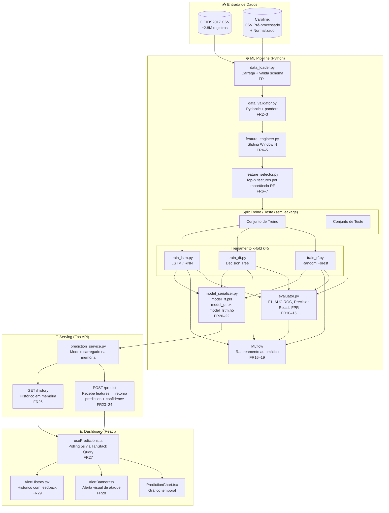

# Architecture Decision Document

_Este documento é construído colaborativamente por descoberta passo a passo. As seções são adicionadas à medida que trabalhamos juntos em cada decisão arquitetural._

## Project Context Analysis

### Requirements Overview

**Functional Requirements — 33 FRs em 8 categorias:**

| Categoria | FRs | Implicação arquitetural |
|---|---|---|
| Ingestão e Preparação de Dados | FR1–FR3 | Módulo de data loading com validação de schema |
| Feature Engineering e Seleção | FR4–FR7 | Pipeline de transformação configurável com sliding window |
| Treinamento e Avaliação de Modelos | FR8–FR15 | Módulo de treino modular suportando RF, DT e LSTM com k-fold |
| Rastreamento de Experimentos | FR16–FR19 | Integração MLflow com logging automático de runs |
| Serialização e Exportação do Modelo | FR20–FR22 | Artefato exportável incluindo todo o pipeline de pré-processamento |
| Serviço de Predição (API) | FR23–FR26 | FastAPI com endpoint `/predict` + mock endpoint |
| Alertas e Visualização | FR27–FR29 | Frontend React com alertas em tempo real, threshold configurável, histórico |
| Reprodutibilidade e Documentação | FR30–FR33 | Seed global configurável, requirements.txt fixado, README reprodutível |

**Non-Functional Requirements — 12 NFRs em 4 categorias:**

| Categoria | Critério-chave | Impacto arquitetural |
|---|---|---|
| Performance | Inferência ≤10s, load ≤5s | Pipeline de inferência leve; modelo com pré-processamento embutido |
| Reprodutibilidade | Variação ≤0.01% com mesmo seed | Random state global, sem fontes de aleatoriedade não controladas |
| Integração | JSON schema validado, CSV contract | Contratos formais entre módulos (Pydantic para API, schema para CSV) |
| Segurança | localhost only, dados sintéticos/públicos | Sem autenticação complexa; isolamento de rede suficiente |

**Scale & Complexity:**

- Complexidade: **Média** — greenfield, escopo científico delimitado, sem multi-tenancy
- Domínio primário: ML Pipeline + Web Interface (full-stack científico)
- Componentes arquiteturais estimados: 4 (Data Pipeline, ML Training, Model Serving API, Frontend Dashboard)

### Technical Constraints & Dependencies

- **Ambiente de treino:** Python 3.10+, CPU local para RF/DT; Google Colab (GPU T4) para LSTM
- **Ambiente de inferência:** Python local, FastAPI, uvicorn
- **Frontend:** React + Tailwind CSS + shadcn/ui + Recharts
- **Experimentos:** MLflow local (`mlflow ui`)
- **Modelo serializado:** `.pkl` (scikit-learn) ou `.h5` (Keras) — com pipeline completo embutido
- **Dataset:** CICIDS2017 (~2.8M registros, CSV público) — entregue normalizado por Caroline
- **Conectividade:** Rede local apenas — sem dependências de serviços externos em produção

### Cross-Cutting Concerns Identified

1. **Data leakage prevention** — Sliding window e feature selection aplicados *após* split train/test
2. **Reprodutibilidade científica** — `random_state=42` global, `requirements.txt` com versões fixadas
3. **Portabilidade do modelo** — Artefato exportado inclui scaler, window transformer e encoder
4. **Contrato de interface de dados** — Schema formal CSV entre Caroline e Emili
5. **Comunicação real-time** — Frontend atualiza alertas via polling ou WebSocket sem reload
6. **Configurabilidade** — Tamanho N da janela, threshold de confiança e seed são parâmetros externos
7. **Rastreamento de experimentos** — MLflow registra automaticamente todos os parâmetros e métricas

---

## Starter Template Evaluation

### Primary Technology Domain

Sistema bi-componente: ML Pipeline (Python) + Dashboard (React). Nenhum starter único cobre ambos — dois scaffoldings independentes com contrato de integração via FastAPI REST.

### Estrutura de Repositório

```
ic-ml-cybersecurity/
├── ml-pipeline/     # Python — treino, avaliação, FastAPI serving
└── dashboard/       # React — interface de monitoramento e alertas
```

### Componente A — Dashboard (Frontend React)

**Starter selecionado:** Vite + React + TypeScript

**Comando de inicialização:**

```bash
npm create vite@latest dashboard -- --template react-ts
cd dashboard && npm install
npx tailwindcss init -p
npx shadcn@latest init
npm install recharts
```

**Decisões arquiteturais do starter:**

- **Linguagem:** TypeScript (strict mode)
- **Build:** Vite (HMR, ESM-native, bundle otimizado)
- **Estilo:** Tailwind CSS + shadcn/ui (tema escuro, componentes copiáveis)
- **Charts:** Recharts (React-native, leve, responsivo)
- **Testes:** Vitest (integrado ao Vite)
- **Estrutura:** `src/components/`, `src/pages/`, `src/hooks/`, `src/services/`

### Componente B — ML Pipeline (Backend Python)

**Starter selecionado:** Cookiecutter Data Science + FastAPI

**Comando de inicialização:**

```bash
pip install cookiecutter
cookiecutter https://github.com/drivendataorg/cookiecutter-data-science
# Adicionar manualmente: src/api/ (FastAPI), mlruns/ (MLflow)
pip install fastapi uvicorn mlflow scikit-learn tensorflow pandas numpy
pip freeze > requirements.txt
```

**Decisões arquiteturais do starter:**

- **Linguagem:** Python 3.10+
- **Estrutura:** `data/`, `notebooks/`, `src/`, `models/`, `reports/`
- **API:** FastAPI em `src/api/` (adicionado manualmente)
- **Tracking:** MLflow em `mlruns/` (configurado em `src/training/`)
- **Dependências:** `requirements.txt` com versões fixadas
- **Reprodutibilidade:** `random_state=42` global em `config.py`

**Nota:** A inicialização dos dois componentes deve ser a primeira história de implementação.

---

## Core Architectural Decisions

### Decision Priority Analysis

**Decisões Críticas (bloqueiam implementação):**
- Contrato de dados CSV com schema validado (Pydantic + pandera)
- Artefatos de modelo com pipeline completo embutido (joblib/.h5)
- Contrato REST entre FastAPI e React (endpoints definidos)

**Decisões Importantes (moldam a arquitetura):**
- TanStack Query para gerenciamento de server state no frontend
- Scripts de treino separados por modelo para clareza científica
- MLflow autolog para rastreamento sem boilerplate

**Decisões Diferidas (pós-MVP):**
- Autenticação (fora do escopo — localhost only)
- CI/CD automatizado (substituído por README reprodutível)

---

### Data Architecture

| Decisão | Escolha | Versão | Rationale |
|---|---|---|---|
| Validação de schema CSV | Pydantic + pandera | pydantic 2.x + pandera 0.20.x | Pydantic já no FastAPI; pandera cobre DataFrame validation |
| Contrato de dados | Schema formal CSV entre Caroline e Emili | — | Previne data leakage e incompatibilidade de features |
| Leakage prevention | Sliding window e feature selection aplicados **após** split train/test | — | Requisito científico fundamental |
| Serialização | `joblib` para sklearn Pipeline (RF/DT) + `.h5` para Keras (LSTM) | joblib 1.3.x / keras 3.x | Pipeline completo embutido: scaler + encoder + modelo |

---

### Storage & Persistence

| Decisão | Escolha | Versão | Rationale |
|---|---|---|---|
| **Banco de dados** | **Nenhum (arquivo + memória)** | — | Ver justificativa abaixo |
| Histórico de predições | Lista em memória na API (até 1000 entradas) | — | Suficiente para sessão de demonstração — sem necessidade de persistência entre reinicializações |
| Modelos treinados | Arquivos `.pkl` / `.h5` no sistema de arquivos | — | Artefatos científicos versionados manualmente via MLflow |
| Dataset de treino | CSV em `data/raw/` e `data/processed/` | — | CICIDS2017 é arquivo estático — não requer SGBD |
| Experimentos ML | MLflow local (`mlruns/`) | mlflow 2.x | Substitui banco de dados para rastreamento de runs e métricas |

**Justificativa da ausência de banco de dados:**

Este projeto é uma Iniciação Científica com escopo acadêmico delimitado. Um banco de dados relacional (PostgreSQL, SQLite) adicionaria complexidade de setup, migração e manutenção sem benefício operacional real:

- O histórico de alertas não precisa sobreviver entre reinicializações do servidor para fins de demonstração
- Os dados de treino são estáticos (CICIDS2017 — arquivo público)
- O rastreamento de experimentos é coberto integralmente pelo MLflow
- O ambiente de execução é local (localhost) — sem múltiplos usuários ou concorrência

> **Decisão:** banco de dados formal está **fora do escopo** desta IC. Se o sistema evoluir para produção real, SQLite (histórico de alertas) e PostgreSQL (multi-usuário) seriam as evoluções naturais.

---

### Streaming vs. Batch Processing

| Decisão | Escolha | Rationale |
|---|---|---|
| **Modelo de processamento** | **Batch com Sliding Window** | Ver justificativa abaixo |
| Plataforma de streaming | **Nenhuma** (Kafka, Flink, Spark Streaming descartados) | Superdimensionado para escopo acadêmico local |
| Simulação de tempo real | Polling REST a cada 5s (TanStack Query) | Comportamento de "tempo real" suficiente para demonstração |
| Janela temporal | Sliding window de tamanho N configurável | N definido experimentalmente nos notebooks |

**Justificativa da ausência de plataforma de streaming:**

Plataformas de streaming real (Apache Kafka, Apache Flink, Spark Streaming) são projetadas para ingestão contínua de dados de múltiplas fontes com vazão de milhões de eventos por segundo. Para esta IC:

- O dataset CICIDS2017 é **estático** — processado em batch, não em fluxo contínuo
- A demonstração ao vivo usa **replay de dados históricos**, não ingestão de tráfego real de rede
- O ambiente de execução é **local e single-node** — sem necessidade de infra distribuída
- O overhead de setup (Kafka brokers, Zookeeper, conectores) seria desproporcional ao benefício científico

A abordagem de **sliding window batch + polling REST** entrega o mesmo comportamento observável ao usuário (alerta a cada ~5s) com complexidade de implementação adequada ao prazo e recursos da IC.

> **Nota científica:** A literatura revisada (14 papers) utiliza majoritariamente batch processing sobre datasets estáticos. A abordagem desta IC é consistente com o estado da arte experimental.

---

### Authentication & Security

| Decisão | Escolha | Rationale |
|---|---|---|
| Autenticação | Nenhuma | localhost only, dados sintéticos/públicos |
| Isolamento | Rede local apenas | uvicorn bind em 127.0.0.1 |
| Dados sensíveis | Nenhum dado pessoal | CICIDS2017 é dataset público |

---

### API & Communication Patterns

| Decisão | Escolha | Rationale |
|---|---|---|
| Formato de resposta | Resposta direta (sem envelope) | Escopo controlado, simplicidade |
| Real-time updates | Polling com intervalo configurável (padrão: 5s) | Sem infra extra; suficiente para dashboard local |
| Endpoints | REST convencional | Ver tabela abaixo |

**Endpoints definidos:**

| Método | Path | Descrição |
|---|---|---|
| `POST` | `/predict` | Recebe features, retorna predição + confiança |
| `GET` | `/health` | Status da API e modelo carregado |
| `GET` | `/model/info` | Metadados do modelo ativo |
| `GET` | `/history` | Histórico de predições |

**Formato de resposta `/predict`:**
```json
{
  "prediction": "DDoS",
  "confidence": 0.94,
  "model": "random_forest",
  "timestamp": "2026-02-21T14:00:00Z"
}
```

**Formato de erro:**
```json
{
  "detail": "Mensagem de erro descritiva",
  "code": "INVALID_FEATURES"
}
```

---

### Frontend Architecture

| Decisão | Escolha | Versão | Rationale |
|---|---|---|---|
| Server state | TanStack Query | v5.x | Polling automático, cache, loading/error states integrados |
| Organização de componentes | Por tipo | — | `components/charts/`, `components/cards/`, `components/alerts/` |
| Routing | Single-page (sem router) | — | Dashboard único, sem necessidade de múltiplas rotas |
| Nomeação de arquivos | PascalCase para componentes | — | `AlertCard.tsx`, `PredictionChart.tsx` |

---

### ML Pipeline Patterns

| Decisão | Escolha | Rationale |
|---|---|---|
| Scripts de treino | Um por modelo (`train_rf.py`, `train_dt.py`, `train_lstm.py`) | Clareza científica, debugabilidade |
| Rastreamento | `mlflow.sklearn.autolog()` + `mlflow.tensorflow.autolog()` | Zero boilerplate |
| Nomenclatura de experimentos | `ic-ml-cybersecurity-{model_type}` | Consistência no MLflow UI |
| Seed global | `RANDOM_SEED=42` em `config.py` | Reprodutibilidade garantida |
| Artefatos nomeados | `model_rf.pkl`, `model_dt.pkl`, `model_lstm.h5` | Convenção explícita |

---

### Infrastructure & Deployment

| Decisão | Escolha | Rationale |
|---|---|---|
| Logging | `logging` padrão Python | Sem dependências extras; nível DEBUG via env var |
| Configuração | `config.py` + `.env` via `python-dotenv` | `RANDOM_SEED`, `WINDOW_SIZE`, `CONFIDENCE_THRESHOLD`, `MODEL_PATH` |
| CI/CD | Nenhum (substituído por README reprodutível) | Projeto acadêmico local |
| Deploy | `uvicorn src/api/main.py --host 127.0.0.1 --port 8000` | Localhost only |

---

### Decision Impact Analysis

**Sequência de implementação:**
1. Setup do repositório (monorepo, ambos os starters)
2. Data contract: schema CSV + validação Pydantic/pandera
3. ML Pipeline: data loading → feature engineering → treino → serialização
4. FastAPI: carregar modelo + endpoints `/predict`, `/health`, `/history`
5. Dashboard React: TanStack Query + polling + visualizações

**Dependências cross-component:**
- Dashboard depende de FastAPI estar disponível em `localhost:8000`
- FastAPI depende de artefato de modelo serializado existir em `models/`
- Treino depende de schema CSV formalizado com Caroline

---

## Implementation Patterns & Consistency Rules

### Naming Patterns

**Código Python:**

| Tipo | Padrão | Exemplos |
|---|---|---|
| Arquivos | `snake_case` | `train_rf.py`, `data_loader.py`, `feature_engineer.py` |
| Classes | `PascalCase` | `FeatureEngineer`, `ModelTrainer`, `PredictionService` |
| Funções e variáveis | `snake_case` | `load_dataset()`, `random_seed`, `window_size` |
| Constantes | `UPPER_SNAKE_CASE` | `RANDOM_SEED`, `WINDOW_SIZE`, `MODEL_PATH` |

**Código React/TypeScript:**

| Tipo | Padrão | Exemplos |
|---|---|---|
| Componentes (arquivo) | `PascalCase` | `AlertCard.tsx`, `PredictionChart.tsx`, `StatusBadge.tsx` |
| Hooks e utilitários | `camelCase` | `usePredictions.ts`, `apiClient.ts`, `formatDate.ts` |
| Variáveis e funções | `camelCase` | `isLoading`, `fetchPredictions()`, `confidenceScore` |

**API (JSON fields):**
- Sempre `snake_case`: `"confidence_score"`, `"model_type"`, `"is_attack"`

---

### Structure Patterns

**Localização de testes:**
- Python: `tests/` na raiz do `ml-pipeline/` — espelha a estrutura de `src/`
- React: co-localizados com o componente — `AlertCard.test.tsx` junto de `AlertCard.tsx`

**Pontos de acesso únicos:**
- Toda chamada à API FastAPI passa por `src/services/api.ts` — sem fetch direto em componentes
- Toda configuração Python centralizada em `config.py` — sem magic strings espalhadas

**Hooks React:**
- Prefixo `use` obrigatório: `usePredictions`, `useAlerts`, `useModelInfo`
- Localização: `src/hooks/`

---

### Format Patterns

| Área | Padrão |
|---|---|
| Timestamps | ISO 8601 — `"2026-02-21T14:00:00Z"` em toda API e logs |
| Booleanos JSON | `true`/`false` — nunca `1`/`0` |
| Campos ausentes | `null` explícito — nunca omitir campo esperado |
| HTTP success | `200 OK` |
| HTTP validação | `422 Unprocessable Entity` (padrão FastAPI) |
| HTTP erro interno | `500 Internal Server Error` |

---

### Error Handling Patterns

**Python — exceções tipadas por domínio:**
```python
class PredictionError(Exception): ...
class ModelNotLoadedError(Exception): ...
class InvalidFeaturesError(Exception): ...
```

**FastAPI — handler global:**
```python
@app.exception_handler(PredictionError)
async def prediction_error_handler(request, exc):
    return JSONResponse(status_code=500, content={"detail": str(exc), "code": "PREDICTION_ERROR"})
```

**React — componente de erro padronizado:**
- TanStack Query expõe `isError` + `error` — exibir via componente `<ErrorAlert message={...} />` reutilizável

---

### Process Patterns

| Padrão | Regra |
|---|---|
| Loading states | Usar `isLoading` do TanStack Query — componente `<LoadingSpinner />` padronizado |
| Retry de API | TanStack Query retry padrão (3x automático) para `/predict` |
| Logging Python | `logger = logging.getLogger(__name__)` em cada módulo — nunca `print()` em produção |
| Polling interval | Configurável via constante `POLLING_INTERVAL_MS = 5000` em `src/config.ts` |

---

### Enforcement Guidelines

**Todos os agentes AI DEVEM:**
- Usar `snake_case` em todo código Python (arquivos, funções, variáveis)
- Usar `PascalCase` exclusivamente para componentes React e classes Python
- Centralizar chamadas de API em `src/services/api.ts`
- Centralizar configurações Python em `config.py`
- Nunca usar `print()` para logging — sempre `logger.info/debug/error()`
- Usar `RANDOM_SEED = 42` de `config.py` em todo código com aleatoriedade
- Retornar timestamps sempre em ISO 8601

**Anti-patterns a evitar:**
- ❌ `fetch('/predict', ...)` diretamente em componente React
- ❌ `random_state=42` hardcoded — usar `config.RANDOM_SEED`
- ❌ Campos JSON em `camelCase` na API (ex: `"confidenceScore"`)
- ❌ `useState` para gerenciar dados vindos da API — usar TanStack Query

---

## Project Structure & Boundaries

### Complete Project Directory Structure

```
ic-ml-cybersecurity/
├── README.md                          # Guia de reprodutibilidade completo
├── .gitignore
│
├── ml-pipeline/                       # Componente Python
│   ├── README.md
│   ├── requirements.txt               # Versões fixadas (pip freeze)
│   ├── config.py                      # RANDOM_SEED, WINDOW_SIZE, CONFIDENCE_THRESHOLD, MODEL_PATH
│   ├── .env                           # Variáveis de ambiente locais (não commitado)
│   ├── .env.example                   # Template de variáveis
│   │
│   ├── data/
│   │   ├── raw/                       # CICIDS2017 CSV original (não commitado)
│   │   ├── processed/                 # CSV pré-processado por Caroline
│   │   └── schema/
│   │       └── features_schema.json   # Contrato formal de features (Caroline ↔ Emili)
│   │
│   ├── models/                        # Artefatos serializados
│   │   ├── model_rf.pkl               # sklearn Pipeline (scaler + encoder + RF)
│   │   ├── model_dt.pkl               # sklearn Pipeline (scaler + encoder + DT)
│   │   └── model_lstm.h5              # Keras model (LSTM)
│   │
│   ├── notebooks/                     # Exploração e prototipagem
│   │   ├── 01_eda.ipynb
│   │   └── 02_model_prototyping.ipynb
│   │
│   ├── src/
│   │   ├── data/
│   │   │   ├── __init__.py
│   │   │   ├── data_loader.py         # FR1: Carrega CSV, valida schema
│   │   │   └── data_validator.py      # FR2–3: Pydantic + pandera validation
│   │   │
│   │   ├── features/
│   │   │   ├── __init__.py
│   │   │   ├── feature_engineer.py    # FR4–5: Sliding window, transformações
│   │   │   └── feature_selector.py    # FR6–7: Seleção de features
│   │   │
│   │   ├── training/
│   │   │   ├── __init__.py
│   │   │   ├── train_rf.py            # FR8–9: Treino Random Forest + MLflow
│   │   │   ├── train_dt.py            # FR8–9: Treino Decision Tree + MLflow
│   │   │   ├── train_lstm.py          # FR8–9: Treino LSTM + MLflow
│   │   │   └── evaluator.py           # FR10–15: Métricas, k-fold, relatórios
│   │   │
│   │   ├── models/
│   │   │   ├── __init__.py
│   │   │   └── model_serializer.py    # FR20–22: Serializa pipeline completo
│   │   │
│   │   └── api/
│   │       ├── __init__.py
│   │       ├── main.py                # FastAPI app, CORS, startup
│   │       ├── routes/
│   │       │   ├── predict.py         # FR23–24: POST /predict
│   │       │   ├── health.py          # FR25: GET /health
│   │       │   └── history.py         # FR26: GET /history
│   │       ├── schemas/
│   │       │   ├── prediction.py      # Pydantic models request/response
│   │       │   └── health.py
│   │       └── services/
│   │           └── prediction_service.py
│   │
│   ├── tests/
│   │   ├── test_data_loader.py
│   │   ├── test_feature_engineer.py
│   │   ├── test_evaluator.py
│   │   └── test_api.py
│   │
│   └── mlruns/                        # MLflow tracking (não commitado)
│
└── dashboard/                         # Componente React
    ├── README.md
    ├── package.json
    ├── vite.config.ts
    ├── tsconfig.json
    ├── tailwind.config.js
    ├── .env                           # VITE_API_URL=http://127.0.0.1:8000
    ├── .env.example
    │
    ├── src/
    │   ├── main.tsx                   # Entry point
    │   ├── App.tsx                    # Root component + QueryClientProvider
    │   ├── config.ts                  # POLLING_INTERVAL_MS, API_BASE_URL
    │   │
    │   ├── services/
    │   │   └── api.ts                 # Único ponto de acesso à FastAPI
    │   │
    │   ├── hooks/
    │   │   ├── usePredictions.ts      # FR27: Polling + TanStack Query
    │   │   ├── useAlerts.ts           # FR28: Alertas por threshold
    │   │   └── useModelInfo.ts        # GET /model/info
    │   │
    │   ├── components/
    │   │   ├── charts/
    │   │   │   ├── PredictionChart.tsx    # FR27: Gráfico de predições (Recharts)
    │   │   │   └── ConfidenceGauge.tsx
    │   │   ├── cards/
    │   │   │   ├── ModelInfoCard.tsx
    │   │   │   └── StatsSummaryCard.tsx
    │   │   ├── alerts/
    │   │   │   ├── AlertBanner.tsx        # FR28: Alerta visual de ataque
    │   │   │   └── AlertHistory.tsx       # FR29: Histórico de alertas
    │   │   └── ui/
    │   │       ├── LoadingSpinner.tsx
    │   │       └── ErrorAlert.tsx
    │   │
    │   ├── pages/
    │   │   └── Dashboard.tsx          # Single-page principal
    │   │
    │   └── types/
    │       └── api.ts                 # TypeScript interfaces para respostas da API
    │
    └── tests/
        ├── AlertBanner.test.tsx
        ├── PredictionChart.test.tsx
        └── usePredictions.test.ts
```

### Architectural Boundaries

**API Boundary (FastAPI ↔ React):**
- URL base: `http://127.0.0.1:8000`
- Único arquivo de acesso no frontend: `src/services/api.ts`
- Tipos TypeScript espelhando schemas Pydantic: `src/types/api.ts`
- CORS configurado para aceitar apenas `http://localhost:5173` (Vite dev)

**Data Boundary (Caroline ↔ ML Pipeline):**
- Contrato formal: `data/schema/features_schema.json`
- Ponto de entrada único: `src/data/data_loader.py` com validação pandera

**Model Boundary (treino ↔ serving):**
- Artefatos com nomes fixados em `models/`
- Carregamento único no startup via `prediction_service.py`
- `MODEL_PATH` configurável via `config.py`

### Requirements to Structure Mapping

| FR Category | Módulo | Arquivos principais |
|---|---|---|
| FR1–3: Ingestão e Preparação | `src/data/` | `data_loader.py`, `data_validator.py` |
| FR4–7: Feature Engineering | `src/features/` | `feature_engineer.py`, `feature_selector.py` |
| FR8–15: Treino e Avaliação | `src/training/` | `train_rf.py`, `train_dt.py`, `train_lstm.py`, `evaluator.py` |
| FR16–19: Rastreamento MLflow | `src/training/` + `mlruns/` | autolog em cada `train_*.py` |
| FR20–22: Serialização | `src/models/` + `models/` | `model_serializer.py` → `model_*.pkl/.h5` |
| FR23–26: API de Predição | `src/api/` | `main.py`, `routes/`, `schemas/`, `services/` |
| FR27–29: Dashboard | `dashboard/src/` | `hooks/`, `components/`, `pages/Dashboard.tsx` |
| FR30–33: Reprodutibilidade | raiz + `config.py` | `config.py`, `requirements.txt`, `README.md` |

### Data Flow

**Diagrama de Fluxo de Dados — Visão Completa:**



**Fluxo simplificado (texto):**

```
CICIDS2017 CSV
    → data_loader.py (FR1) → data_validator.py (FR2–3)
    → feature_engineer.py (FR4–5) → feature_selector.py (FR6–7)
    → train_rf/dt/lstm.py (FR8–9) + MLflow autolog (FR16–19)
    → evaluator.py (FR10–15)
    → model_serializer.py (FR20–22) → models/*.pkl/.h5

Serving:
    prediction_service.py ← models/*.pkl/.h5
    FastAPI routes (FR23–26)
    ← api.ts ← usePredictions.ts (polling 5s) ← Dashboard.tsx (FR27–29)
```

---

## Architecture Validation Results

### Coherence Validation ✅

**Compatibilidade de tecnologias:** Todas as tecnologias escolhidas são compatíveis. Pydantic 2.x e FastAPI são nativamente integrados. TanStack Query v5 e React 18 formam stack moderna sem conflitos. joblib e scikit-learn são par padrão para serialização de pipelines.

**Consistência de padrões:** Fronteira de nomenclatura clara e documentada: `snake_case` Python ↔ `snake_case` JSON ↔ `camelCase` TypeScript interno. Ponto único de acesso à API (`src/services/api.ts`) e configuração centralizada (`config.py`) eliminam categorias inteiras de inconsistência.

**Alinhamento estrutural:** Estrutura de diretórios suporta todas as decisões arquiteturais. Boundaries (API, Data, Model) bem definidos com pontos de entrada únicos.

### Requirements Coverage Validation ✅

**Functional Requirements — 33/33 cobertos:**

| Categoria | FRs | Status |
|---|---|---|
| Ingestão e Preparação | FR1–3 | ✅ `data_loader.py` + `data_validator.py` |
| Feature Engineering | FR4–7 | ✅ `feature_engineer.py` + `feature_selector.py` |
| Treino e Avaliação | FR8–15 | ✅ `train_*.py` + `evaluator.py` |
| Rastreamento MLflow | FR16–19 | ✅ autolog em `train_*.py` |
| Serialização | FR20–22 | ✅ `model_serializer.py` + artefatos nomeados |
| API de Predição | FR23–26 | ✅ FastAPI routes + schemas + services |
| Alertas e Visualização | FR27–29 | ✅ hooks + components + polling |
| Reprodutibilidade | FR30–33 | ✅ `config.py` + `requirements.txt` + `README.md` |

**Non-Functional Requirements — 12/12 cobertos:**

| Critério | Solução |
|---|---|
| Inferência ≤10s | Pipeline leve; modelo pré-carregado no startup |
| Load ≤5s | Modelo em memória desde o `startup` do FastAPI |
| Variação ≤0.01% | `RANDOM_SEED=42` global em `config.py` |
| JSON schema validado | Pydantic schemas em `src/api/schemas/` |
| CSV contract | `data/schema/features_schema.json` |
| localhost only | `uvicorn --host 127.0.0.1`; CORS restrito |

### Implementation Readiness Validation ✅

- **Decisões completas:** 5 categorias documentadas com versões verificadas
- **Estrutura completa:** Árvore específica com mapeamento explícito FR → arquivo
- **Padrões completos:** Naming, structure, format, error handling e process definidos
- **Conflitos potenciais endereçados:** 5 áreas identificadas e resolvidas com anti-patterns documentados

### Gap Analysis

**Gaps críticos:** Nenhum ✅

**Gaps importantes (a resolver antes ou durante implementação):**
- ⚠️ `features_schema.json` deve ser co-criado com Caroline antes do desenvolvimento de `data_loader.py`
- ⚠️ Valor concreto de `WINDOW_SIZE` (N) a ser definido experimentalmente nos notebooks
- ⚠️ **Conjunto final de features do CICIDS2017** a ser documentado após execução do `feature_selector.py` — requer implementação experimental

**Decisões explicitamente documentadas (não-lacunas):**
- ✅ Banco de dados: ausência justificada (batch + memória + MLflow suficientes para IC)
- ✅ Plataforma de streaming: descartada (batch com sliding window + polling REST — justificado na seção Storage)
- ✅ Diagrama de fluxo: disponível em formato Mermaid e textual

### Architecture Completeness Checklist

**✅ Requirements Analysis**
- [x] Contexto do projeto analisado
- [x] Escala e complexidade avaliados
- [x] Restrições técnicas identificadas
- [x] Preocupações transversais mapeadas

**✅ Architectural Decisions**
- [x] Decisões críticas documentadas com versões
- [x] Stack tecnológico completamente especificado
- [x] Padrões de integração definidos
- [x] Considerações de performance endereçadas

**✅ Implementation Patterns**
- [x] Convenções de nomenclatura estabelecidas
- [x] Padrões de estrutura definidos
- [x] Padrões de comunicação especificados
- [x] Padrões de processo documentados

**✅ Project Structure**
- [x] Estrutura completa de diretórios definida
- [x] Boundaries de componentes estabelecidos
- [x] Pontos de integração mapeados
- [x] Mapeamento requirements → estrutura completo

### Architecture Readiness Assessment

**Status: READY FOR IMPLEMENTATION** | **Confiança: Alta**

**Pontos fortes:**
- Reprodutibilidade científica garantida por design (seed global, pipeline embutido no artefato)
- Contrato de dados formalizado previne erros de integração com Caroline
- Separação clara treino/serving por design — sem risco de data leakage em produção
- TanStack Query elimina categoria inteira de bugs de estado no frontend
- Estrutura modular permite desenvolvimento independente dos dois componentes

**Melhorias futuras:**
- Dockerização para portabilidade total
- CI mínimo para validar reprodutibilidade automaticamente

### Implementation Handoff

**Primeiro passo de implementação:**
```bash
# 1. Inicializar ml-pipeline
pip install cookiecutter
cookiecutter https://github.com/drivendataorg/cookiecutter-data-science

# 2. Inicializar dashboard
npm create vite@latest dashboard -- --template react-ts
cd dashboard && npm install
npx tailwindcss init -p && npx shadcn@latest init
npm install recharts @tanstack/react-query
```

**Referência obrigatória:** Este documento é a fonte única de verdade para todas as decisões técnicas. Todos os agentes AI devem consultá-lo antes de implementar qualquer componente.
