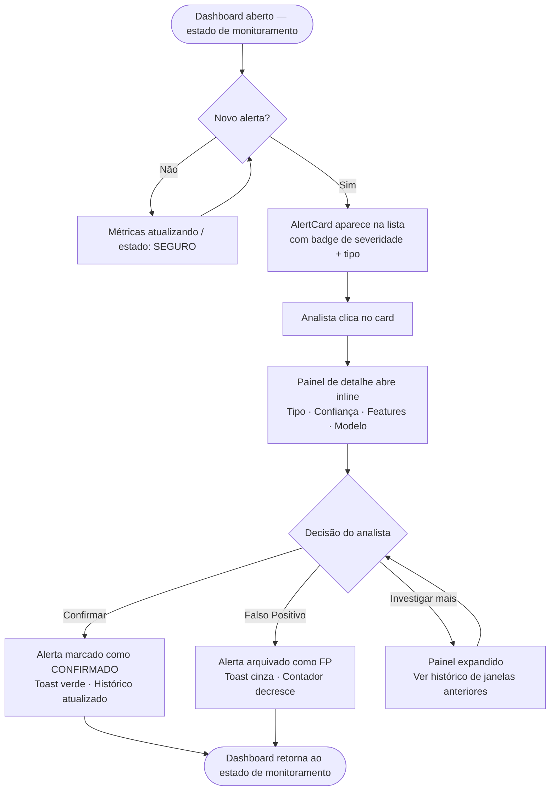
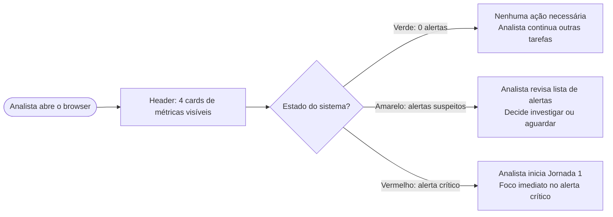
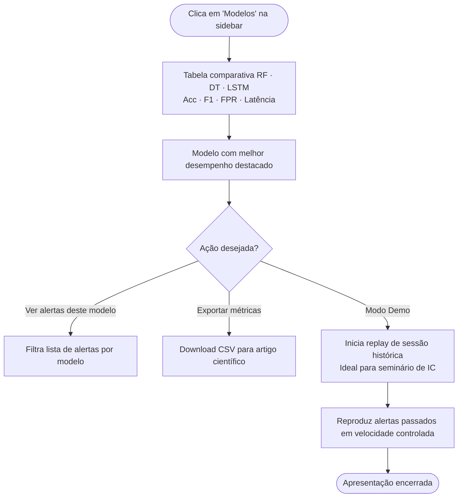

# UX Design Specification ic-ml-cybersecurity

**Author:** Emili-tabuti
**Date:** 2026-02-21

---

<!-- UX design content will be appended sequentially through collaborative workflow steps -->

## Executive Summary

### Visão do Projeto

Sistema de previsão antecipada de ataques cibernéticos baseado em Machine Learning, desenvolvido como Iniciação Científica no FCET. A interface de monitoramento exibe alertas *antes* da concretização dos ataques, com latência ≤10 segundos. O sistema analisa janelas temporais deslizantes de tráfego de rede e compara o desempenho de três modelos: Random Forest, Decision Tree e LSTM/RNN. O produto possui duplo valor: operacional (apoio ao analista de segurança) e científico (evidência empírica sobre qual paradigma de ML é mais eficaz para previsão antecipada).

### Usuários-alvo

**Perfil primário — Analista de segurança em rede acadêmica:**
- Conhecimento técnico moderado-alto em redes, mas não necessariamente em ML
- Necessita de alertas **proativos**, não reativos — age antes da concretização do ataque
- Opera em ambiente desktop/workstation em monitoramento contínuo
- Tolerância zero a alertas não confiáveis — meta de ≤10% de falsos positivos
- Precisa compreender *por que* o sistema previu um ataque, não apenas *que* ele previu

**Perfil secundário — Pesquisadora/Apresentadora (contexto de IC):**
- Necessita de modo de demonstração para seminários e apresentação de resultados
- Interesse em visualizar comparação de desempenho entre modelos (RF, DT, LSTM)

### Desafios-chave de Design

1. **Confiança no modelo:** O analista precisa entender o nível de confiança e quais features de tráfego motivaram o alerta — sem isso, o sistema não é acionável
2. **Fadiga de alertas:** O design deve comunicar prioridade e severidade com clareza para evitar que alertas frequentes percam relevância operacional
3. **Visualização temporal:** Representar a janela deslizante de tráfego de forma compreensível para justificar a predição de série temporal

### Oportunidades de Design

1. **Painel de comparação de modelos:** Exibir qual algoritmo gerou o alerta e as métricas de desempenho comparativas (RF vs DT vs LSTM) — alto valor científico e educacional
2. **Timeline de eventos:** Histórico visual de alertas com contexto temporal cria valor tanto para resposta a incidentes quanto para análise científica posterior
3. **Modo de demonstração/replay:** Interface pensada para apresentações no seminário de IC — reprodução de sessões de monitoramento com dados históricos

## Core User Experience

### 2.1 Defining Experience

> *"Receber um alerta de ameaça prevista e entender imediatamente — em menos de 5 segundos — o que está acontecendo, por que o modelo previu isso, e o que fazer."*

A interação central do ic-ml-cybersecurity é o **ciclo alerta → compreensão → decisão**. Se esse fluxo funcionar perfeitamente, tudo mais é complementar. É a interação que o analista descreve ao recomendar o sistema a um colega.

### 2.2 User Mental Model

O analista de segurança chega com o modelo mental de ferramentas **reativas** (SIEM, IDS): *"ataque aconteceu → log gerado → analista investiga"*. Esta interface inverte esse paradigma: *"modelo previu → analista é avisado → analista age antes"*.

Este shift é **genuinamente novo** para o usuário. A interface deve educar esse novo paradigma sutilmente — através de linguagem ("ameaça prevista", não "ameaça detectada") e da ordem visual dos elementos — sem exigir treinamento explícito.

### 2.3 Success Criteria

- Alerta compreendido em **<5 segundos** — tipo de ameaça + confiança + contexto visíveis sem scroll
- Decisão tomada com **1-2 cliques** — confirmar / marcar falso positivo / investigar
- Estado do sistema legível **sem interação** — apenas olhando para o dashboard
- **Nenhuma navegação necessária** para acessar a informação crítica do alerta

### 2.4 Novel UX Patterns

**Padrão estabelecido adaptado:** Alert card com severidade por cor (Kibana/SIEM) — familiar para analistas de segurança, adaptado com camada de explicabilidade ML

**Elemento novo:** Exibição de **top features de tráfego** que motivaram a predição — não existe em ferramentas tradicionais reativas; requer apresentação cuidadosa para não parecer "caixa preta"

**Metáfora familiar usada:** Semáforo de cores (vermelho/amarelo/verde) para severidade — universal, decodificado instantaneamente

### 2.5 Experience Mechanics

**1. Iniciação**
- Notificação visual automática aparece no dashboard sem refresh manual
- Badge de contagem no título da aba do browser atualiza em tempo real
- Som de alerta opcional (configurável) para monitoramento passivo

**2. Interação**
- Clique no card do alerta abre painel de detalhes inline (sem navegar para outra página)
- Painel exibe: tipo de ataque previsto + nível de confiança (%) + janela temporal + top 3 features de tráfego com valores observados vs. baseline
- Três ações disponíveis com botões claros: **Confirmar** / **Falso Positivo** / **Ver Histórico**

**3. Feedback**
- Alerta tratado muda de cor e estado imediatamente — sem recarregar página
- Feedback visual de confirmação (toast) aparece por 3 segundos
- Contador de alertas ativos no header decresce em tempo real

**4. Conclusão**
- Analista retorna ao estado de monitoramento — dashboard volta ao estado "tranquilo"
- Alerta tratado migra automaticamente para a seção de histórico
- Registro da decisão do analista fica vinculado ao alerta no histórico para análise posterior

### 2.6 Platform Strategy

- **Plataforma:** Aplicação web (browser-based), servida localmente via backend Python
- **Acesso:** Rede local do laboratório — sem necessidade de acesso remoto externo
- **Conectividade:** Funciona inteiramente offline (rede interna), sem dependência de serviços externos
- **Input:** Primariamente mouse e teclado (desktop/workstation)
- **Vantagem:** Zero instalação para o usuário — acessa pelo browser, ideal para demonstrações em seminário

### 2.7 Experience Principles

1. **Clareza antes de completude** — Um alerta compreendido em 3 segundos vale mais que um painel cheio de dados
2. **Confiança explícita** — Sempre mostrar *por que* o modelo previu o ataque, nunca só *que* previu
3. **Zero fricção no fluxo crítico** — O caminho alerta → decisão deve ser direto e sem obstáculos
4. **Duplo valor: operacional e científico** — A mesma interface serve ao analista de segurança e à pesquisadora que apresenta resultados

## Desired Emotional Response

### Primary Emotional Goals

O objetivo emocional central do **ic-ml-cybersecurity** é fazer o analista sentir **confiança ativa** — não apenas que o sistema funciona, mas que *ele próprio* está no controle da situação, apoiado por um modelo confiável. A interface deve transformar ceticismo natural em confiança fundamentada, através de transparência e clareza.

### Emotional Journey Mapping

| Momento | Emoção desejada | Emoção a evitar |
|---|---|---|
| Primeira vez na interface | Impressionado, curioso | Confuso, sobrecarregado |
| Monitoramento ativo (sem alertas) | Tranquilo, em controle | Ansioso, entediado |
| Alerta recebido | Atento, confiante | Alarmado, paralisado |
| Investigando o alerta | Competente, empoderado | Perdido, frustrado |
| Falso positivo confirmado | Compreensivo, sem ressentimento | Enganado, irritado |
| Demo no seminário | Orgulhosa, confiante | Nervosa, envergonhada |

### Micro-Emotions

**Tensão emocional principal: Confiança vs. Ceticismo**

O analista chega à interface com ceticismo legítimo — "Por que devo confiar nesse modelo?" A interface deve converter esse ceticismo em confiança progressiva através de:
- Transparência sobre *como* e *por que* o modelo tomou a decisão
- Histórico de acertos visível e acessível
- Nível de confiança do modelo exibido de forma honesta (incluindo incerteza)

**Micro-emoções de suporte:**
- **Controle** — o analista decide, o modelo informa; nunca o inverso
- **Clareza** — zero ambiguidade na leitura de alertas
- **Competência** — a interface faz o analista sentir-se mais capaz, não dependente

### Design Implications

- **Confiança → Explicabilidade:** Cada alerta exibe as top features de tráfego que motivaram a predição (ex: "volume de pacotes 3x acima do normal nas últimas 2 janelas")
- **Controle → Hierarquia visual clara:** O analista vê o alerta → investiga → decide; a interface nunca age por ele
- **Ceticismo → Métricas de desempenho visíveis:** Precisão histórica do modelo disponível a um clique — o analista pode avaliar o modelo antes de confiar
- **Falso positivo → Feedback sem punição:** Marcar um falso positivo deve ser fácil e sem fricção, reforçando que o analista tem a palavra final

### Emotional Design Principles

1. **Transparência gera confiança** — Nunca esconder a incerteza do modelo — exibir o nível de confiança com honestidade
2. **O analista é o decisor, não o modelo** — A linguagem e hierarquia da interface reforçam sempre que a predição é uma *sugestão informada*, não uma ordem
3. **Erros não destroem a confiança** — Falsos positivos são tratados com leveza; o design normaliza imperfeição do ML como parte do processo científico
4. **Progresso visível aumenta confiança** — Histórico de alertas corretos cria evidência acumulada que o sistema funciona

## UX Pattern Analysis & Inspiration

### Inspiring Products Analysis

**1. Grafana** *(dashboard de monitoramento em tempo real)*
- Excelente em: painéis modulares com métricas em tempo real, sistema de alertas com severidade por cor, gráficos de série temporal legíveis
- Padrão relevante: **Status bar no topo** com estado geral do sistema (verde/amarelo/vermelho) — o analista sabe instantaneamente se há algo errado sem ler nada
- Limitação a evitar: configuração complexa demais para usuários não-técnicos

**2. Kibana / SIEM dashboards** *(visualização de eventos de segurança)*
- Excelente em: timeline de eventos, filtros rápidos por tipo de ameaça, drill-down de logs
- Padrão relevante: **Lista de alertas com badge de severidade** — alta, média, baixa — com timestamp e tipo de evento visíveis na linha
- Limitação a evitar: visual sobrecarregado, muito dado bruto sem síntese

**3. Weights & Biases (W&B)** *(comparação de experimentos ML)*
- Excelente em: tabela de comparação de modelos side-by-side, curvas de métricas sobrepostas
- Padrão relevante: **Comparação de modelos em tabela com highlight do melhor** — perfeito para RF vs DT vs LSTM
- Limitação a evitar: focado em pesquisadores, não em operadores

### Transferable UX Patterns

**Navegação:**
- **Sidebar fixa com seções** (Grafana): Monitor → Alertas → Histórico → Modelos — navegação clara sem perder contexto
- **Status global sempre visível** (Grafana): header fixo com estado atual do sistema

**Interação:**
- **Alert card com severidade por cor** (Kibana): vermelho = crítico, amarelo = suspeito, cinza = informacional — decodificado em <1 segundo
- **Drill-down progressivo** (Kibana): lista de alertas → detalhe do alerta → features que motivaram a predição
- **Comparação side-by-side de modelos** (W&B): tabela com RF, DT, LSTM e suas métricas — valor científico imediato

**Visual:**
- **Tema escuro** (padrão em ferramentas de segurança): reduz fadiga visual em monitoramento contínuo, comunica seriedade
- **Gráfico de série temporal com janela deslizante destacada**: mostra visualmente qual janela de tráfego gerou o alerta

### Anti-Patterns to Avoid

- **Painel sobrecarregado de dados brutos** (problema do Kibana): o analista não deve precisar interpretar — a interface interpreta por ele
- **Alertas sem contexto** ("Ataque detectado" sem explicação): gera ceticismo imediato — viola princípio emocional central
- **Configuração obrigatória antes de usar**: para IC e demo, zero setup deve ser necessário para visualizar alertas
- **Modal de confirmação para ações simples**: marcar falso positivo não pode ter 3 cliques

### Design Inspiration Strategy

| | O quê | Por quê |
|---|---|---|
| **Adotar** | Status bar global de Grafana | Clareza imediata do estado do sistema |
| **Adotar** | Alert card com severidade por cor do Kibana | Decodificação <1 segundo |
| **Adotar** | Tema escuro | Padrão do domínio, reduz fadiga visual |
| **Adaptar** | Comparação de modelos do W&B | Simplificar para 3 modelos, foco em métricas-chave do IC |
| **Adaptar** | Drill-down do Kibana | Adicionar explicabilidade ML (top features) ao detalhe do alerta |
| **Evitar** | Densidade de dados brutos do Kibana | Conflita com princípio "clareza antes de completude" |

## Visual Design Foundation

### Color System

**Filosofia:** Cores funcionais, não decorativas. Cada cor comunica significado preciso — o analista decifra o estado do sistema instantaneamente, sem ler texto.

**Paleta base (backgrounds)**

| Token | Hex | Uso |
|---|---|---|
| `bg-base` | `#0F1117` | Fundo principal |
| `bg-surface` | `#1A1D27` | Cards, painéis, sidebar |
| `bg-elevated` | `#242736` | Modais, tooltips, hover states |
| `border` | `#2E3147` | Bordas sutis entre elementos |

**Paleta semântica (significado)**

| Token | Hex | Uso |
|---|---|---|
| `critical` | `#EF4444` | Alerta crítico — alta confiança de ataque iminente |
| `warning` | `#F59E0B` | Alerta suspeito — confiança moderada |
| `safe` | `#10B981` | Estado seguro — sem alertas ativos |
| `info` | `#3B82F6` | Informacional — dados de modelo, métricas |
| `muted` | `#6B7280` | Texto secundário, labels, timestamps |

**Paleta de texto**

| Token | Hex | Uso |
|---|---|---|
| `text-primary` | `#F1F5F9` | Títulos, alertas, informação crítica |
| `text-secondary` | `#94A3B8` | Labels, descrições, metadados |
| `text-code` | `#7DD3FC` | IPs, valores de features, dados técnicos |

### Typography System

- **Interface geral:** Inter (Regular 400, Medium 500, SemiBold 600)
- **Dados técnicos:** JetBrains Mono — IPs, timestamps, valores de features de tráfego
- **Escala:** 12px (labels) → 13px (body) → 16px (h3) → 20px (h2) → 28px (h1 dashboard)
- **Tom geral:** Profissional, técnico, preciso — sem elementos decorativos desnecessários

### Spacing & Layout Foundation

- **Unidade base:** 4px — múltiplos de 4 (sistema Tailwind padrão)
- **Layout:** Sidebar fixa 240px + área principal fluida
- **Padding da área principal:** 24px
- **Gap entre cards:** 12px | Padding interno dos cards: 16px
- **Densidade:** Compacta — máximo de informação por tela sem poluição visual

**Estrutura de navegação (sidebar):**
1. Monitor (estado em tempo real)
2. Alertas (lista ativa)
3. Histórico (alertas tratados + timeline)
4. Modelos (comparação RF / DT / LSTM)

### Accessibility Considerations

- Todas as combinações texto/fundo atingem contraste WCAG AA (≥4.5:1)
- `text-primary` (#F1F5F9) sobre `bg-base` (#0F1117) = 14.5:1 — nível AAA
- Severidade nunca comunicada apenas por cor — sempre acompanhada de ícone e label textual
- Tamanho mínimo de fonte: 12px para labels, 13px para conteúdo lido ativamente

## Design System Foundation

### Design System Choice

**Tailwind CSS + shadcn/ui**

Sistema de design tematizável baseado em componentes copiáveis, com suporte nativo a tema escuro e ampla compatibilidade com bibliotecas de visualização de dados (Recharts, Chart.js).

### Rationale for Selection

1. **Tema escuro nativo** — essencial para interface de segurança/monitoramento; sem configuração adicional
2. **Componentes prontos para dashboards** — tabelas, badges de severidade, cards, gráficos integram sem overhead
3. **Zero dependência opaca** — componentes são copiados no código, totalmente adaptáveis para necessidades específicas do projeto
4. **Escopo de IC** — velocidade de desenvolvimento compatível com prazo acadêmico, sem sacrificar qualidade visual
5. **Sem restrições tecnológicas** — nenhuma obrigação de framework pré-existente; escolha limpa

### Implementation Approach

- **Stack frontend:** React + Tailwind CSS + shadcn/ui
- **Componentes de gráficos:** Recharts (integração nativa com React, leve, responsivo)
- **Integração de backend:** via API Python — detalhes de stack no documento de arquitetura

### Customization Strategy

- **Paleta de cores:** Tema escuro com vermelho crítico / amarelo suspeito / verde seguro — padrão de semáforo de segurança
- **Tipografia:** Fonte monospace para dados técnicos (IPs, timestamps, features de tráfego); sans-serif para textos de interface
- **Densidade:** Layout compacto para dashboard de monitoramento — mais informação por tela, sem poluição visual
- **Componentes customizados necessários:** AlertCard (com severidade + confiança + features), ModelComparisonTable, SlidingWindowChart, TimelineEvents

## Design Direction Decision

### Design Directions Explored

Quatro direções foram exploradas e visualizadas interativamente em `ux-design-directions.html`:
- **A · Command Center** — Sidebar fixa + dashboard denso com métricas em destaque
- **B · Split Focus** — Layout 50/50 lista/detalhe
- **C · Minimal Alert** — Cards expandíveis sem sidebar, máxima simplicidade
- **D · Scientific** — Foco em comparação de modelos e gráfico de janela deslizante

### Chosen Direction

**Direção A — Command Center**

### Design Rationale

1. **Controle e presença** — Sidebar fixa comunica imediatamente as seções disponíveis; o analista nunca se perde no sistema
2. **Métricas sempre visíveis** — 4 cards de métricas no topo (alertas ativos, janelas analisadas, precisão do modelo, latência) respondem ao princípio "estado do sistema legível sem interação"
3. **Painel de detalhe inline** — Split alerts/detail dentro do dashboard mantém o fluxo alerta → compreensão → decisão sem mudança de tela
4. **Familiaridade para analistas** — Sensação de Grafana/SIEM já conhecida pelo perfil de usuário, reduz curva de aprendizado
5. **Escalabilidade** — Layout suporta crescimento natural sem reestruturar a interface

### Implementation Approach

- **Estrutura:** Sidebar 220px fixa + área principal fluida
- **Componentes prioritários:** MetricCard, AlertList, AlertDetailPanel, SidebarNav
- **Estado padrão:** AlertList + AlertDetailPanel como tela principal
- **Responsividade:** Desktop-first (workstation do laboratório); sidebar colapsável em telas menores

## User Journey Flows

### Jornada 1 — Receber e Tratar um Alerta *(jornada principal)*

O analista está com o dashboard aberto em monitoramento passivo. Um novo alerta aparece automaticamente. Ele avalia, decide e o sistema retorna ao estado seguro.

### Jornada 2 — Verificar Estado do Sistema *(monitoramento passivo)*

O analista abre o browser e verifica o estado geral em segundos, sem interação além de olhar.

### Jornada 3 — Comparar Desempenho dos Modelos *(valor científico / seminário)*

A pesquisadora acessa a seção de modelos para analisar RF vs DT vs LSTM ou iniciar modo de demonstração.

### Journey Patterns

- **Navegação:** Sidebar como âncora constante — o analista sempre sabe onde está
- **Feedback:** Todo estado comunica cor + ícone + texto — nunca apenas cor isolada
- **Recuperação:** Ações de decisão (confirmar, marcar FP) têm desfazer disponível por 5s via toast
- **Retorno ao base:** Toda jornada termina no estado de monitoramento — o sistema reseta ao estado seguro por padrão

### Flow Optimization Principles

1. **Zero cliques para ler o estado** — O analista entende o estado do sistema sem interagir com nada
2. **Dois cliques para decidir** — Lista → Detalhe → Decisão: máximo de passos para tratar um alerta
3. **Nenhuma navegação fora do dashboard** — O fluxo principal ocorre inteiro na tela principal
4. **Modo demo em um clique** — Acessível diretamente da seção Modelos, sem setup adicional

## Component Strategy

### Design System Components

Baseado em **Tailwind CSS + shadcn/ui**, os seguintes componentes são utilizados diretamente:

| Componente | Uso no projeto |
|---|---|
| `Badge` | Severidade do alerta (crítico/suspeito/info) |
| `Card` | Container base dos AlertCards e MetricCards |
| `Button` | Ações: Confirmar, Falso Positivo, Detalhes |
| `Toast` | Feedback de ações (confirmação, FP marcado) |
| `Table` | Comparação de modelos RF/DT/LSTM |
| `Separator` | Divisões entre seções da sidebar e painéis |
| `Tooltip` | Explicações de features técnicas ao hover |
| `ScrollArea` | Lista de alertas com scroll sem quebrar layout |

### Custom Components

**`AlertCard`** — Componente central do sistema
- **Anatomia:** Dot severidade + tipo de ataque + IP origem + confiança (%) + modelo + timestamp
- **Estados:** default / hover / selected / resolved / false-positive
- **Variantes:** compacto (lista) / expandido (com features de tráfego)
- **Acessibilidade:** `role="article"`, `aria-label="Alerta: {tipo}, confiança {%}"`

**`ConfidenceBar`** — Visualização do nível de confiança do modelo
- **Anatomia:** Barra preenchida + valor % + label contextual
- **Estados:** crítico (vermelho ≥80%) / suspeito (amarelo 50–79%) / baixo (cinza <50%)
- **Acessibilidade:** `aria-valuenow`, `aria-valuemin`, `aria-valuemax`

**`FeatureExplainer`** — Top features que motivaram a predição
- **Anatomia:** Nome da feature (monospace) + valor observado + delta vs. baseline
- **Interação:** Tooltip com definição da feature ao hover
- **Estados:** normal / elevated / anomalous

**`MetricCard`** — Cards de métricas do topo do dashboard
- **Anatomia:** Label + valor grande (monospace) + subtexto contextual + cor semântica
- **4 instâncias:** alertas ativos / janelas analisadas / precisão do modelo / latência

**`SlidingWindowChart`** — Gráfico de barras da janela temporal de tráfego
- **Anatomia:** Barras coloridas por nível + legenda + anotação de anomalia
- **Biblioteca:** Recharts (`BarChart`)
- **Estados:** normal / elevado / alerta

**`ModelComparisonRow`** — Linha da tabela de comparação com destaque do melhor modelo
- **Anatomia:** Nome + Acc + F1 + FPR + badge "BEST" condicional
- **Estados:** default / best (fundo `#0F1826`, texto `#10B981`)

### Component Implementation Strategy

- Todos os componentes customizados usam os design tokens (cores, tipografia, espaçamento) estabelecidos na fundação visual
- Componentes do shadcn/ui são copiados e customizados localmente — sem dependência opaca
- Acessibilidade como requisito, não adição posterior — ARIA labels em todos os componentes interativos
- Componentes seguem variante única de estado: cada estado é visualmente distinto sem ambiguidade

### Implementation Roadmap

**Fase 1 — Fluxo principal (Jornada 1 — alerta → decisão)**
`AlertCard` · `ConfidenceBar` · `FeatureExplainer` · `MetricCard`

**Fase 2 — Análise científica (Jornada 3 — comparação de modelos)**
`ModelComparisonRow` · `SlidingWindowChart`

**Fase 3 — Polimento e modo demo**
`Toast` com desfazer (5s) · Animações de transição de estado · Modo Demo/replay para seminário

## UX Consistency Patterns

### Button Hierarchy

| Tipo | Visual | Quando usar |
|---|---|---|
| **Primário** | Fundo `#065F46`, texto `#10B981` | Ação principal: "Confirmar Ameaça" |
| **Secundário** | Borda `#2E3147`, texto `#6B7280` | Ação alternativa: "Falso Positivo", "Ver Detalhes" |
| **Ghost** | Sem fundo, texto `#94A3B8` | Ações de baixa prioridade na sidebar e headers |

**Regra:** Nunca mais de 1 botão primário por contexto. O analista nunca deve duvidar qual ação é a principal.

### Feedback Patterns

| Situação | Padrão | Duração |
|---|---|---|
| Ameaça confirmada | Toast verde + ícone ✓ + "Alerta confirmado" | 4s com opção "Desfazer" |
| Falso positivo marcado | Toast cinza + ícone ✕ + "Marcado como FP" | 4s com opção "Desfazer" |
| Novo alerta chegando | AlertCard com animação slide-in suave | Permanente até tratado |
| Erro de conexão | Banner fixo no topo + dot de status vermelho | Persistente até reconectar |
| Carregando dados | Skeleton loader nos cards, não spinner global | Enquanto carrega |

### Navigation Patterns

- **Item ativo na sidebar:** Borda esquerda azul + fundo levemente elevado — nunca bold isolado
- **Estado atual:** Sempre visível no header como breadcrumb (ex: "Monitor / Alertas Ativos")
- **Transições:** 150ms ease — rápido sem ser abrupto
- **Foco de teclado:** `ring-2 ring-blue-500` visível em todos os elementos interativos

### Empty States & Loading

- **Zero alertas ativos:** Estado verde com "Sistema monitorando — nenhuma ameaça prevista" — nunca tela em branco
- **Dados históricos vazios:** Mensagem contextual + sugestão de ação
- **Primeiro acesso:** Dashboard funcional imediatamente — sem onboarding forçado

### Technical Data Patterns

- **IPs e timestamps:** Fonte monospace `JetBrains Mono`, cor `#7DD3FC`
- **Percentuais de confiança:** Sempre com 1 casa decimal (ex: "91.3%", nunca "91%")
- **Nomes de features:** Exatamente como no dataset (`pkt_rate`, `flow_bytes_s`) — sem tradução que gere ambiguidade
- **Tooltips em features:** Sempre disponíveis para explicar o significado técnico ao hover

## Responsive Design & Accessibility

### Responsive Strategy

**Desktop (prioridade principal):** Layout Command Center com sidebar 220px + área principal fluida a partir de 1280px. AlertList e DetailPanel exibidos lado a lado. Caso de uso primário — workstation de laboratório.

**Tablet (suporte secundário):** Sidebar colapsável em modo ícone (64px). AlertList e DetailPanel empilhados verticalmente. Útil para demonstrações durante seminário.

**Mobile (suporte básico):** Sidebar oculta com menu hamburger. Uma seção visível por vez. Funcionalidade completa preservada — consulta rápida, não caso de uso principal.

### Breakpoint Strategy

Estratégia **desktop-first** — layout completo é a experiência primária, adaptada progressivamente para telas menores.

| Breakpoint | Largura | Layout |
|---|---|---|
| `sm` | ≥640px | Mobile com sidebar hamburger |
| `md` | ≥768px | Tablet com sidebar colapsável |
| `lg` | ≥1024px | Desktop — layout completo |
| `xl` | ≥1280px | Desktop amplo — painel de detalhe expandido |

### Accessibility Strategy

**Nível alvo: WCAG AA** — padrão adequado para projeto acadêmico com potencial de uso real.

| Requisito | Implementação |
|---|---|
| Contraste mínimo 4.5:1 | Paleta já validada — texto primário: 14.5:1 |
| Navegação por teclado | Tab order: sidebar → métricas → lista de alertas → detalhe |
| Indicadores de foco | `ring-2 ring-blue-500` em todos os elementos interativos |
| Screen readers | `aria-label` em AlertCards, `aria-live` para novos alertas |
| Alvos de toque | Mínimo 44×44px em todos os botões e itens clicáveis |
| Severidade não apenas por cor | Sempre acompanhada de ícone + label textual |
| Novos alertas | `aria-live="polite"` anuncia automaticamente para screen readers |

### Testing Strategy

- **Responsividade:** Chrome DevTools (mobile simulator) + teste em monitores reais do laboratório
- **Acessibilidade:** axe DevTools (extensão Chrome) para testes automatizados + navegação manual por teclado
- **Performance:** Lighthouse — meta de carregamento <3s na rede local

### Implementation Guidelines

- Usar unidades relativas (`rem`, `%`) em vez de pixels fixos para texto e espaçamento
- Media queries via Tailwind (`sm:`, `md:`, `lg:`, `xl:`) — mobile-first como padrão de escrita
- HTML semântico: `<nav>`, `<main>`, `<section>`, `<article>` para AlertCards
- Gerenciamento de foco: ao abrir painel de detalhe, foco move para o painel automaticamente
- Modo de alto contraste do sistema operacional: respeitado via `@media (prefers-contrast: high)`
