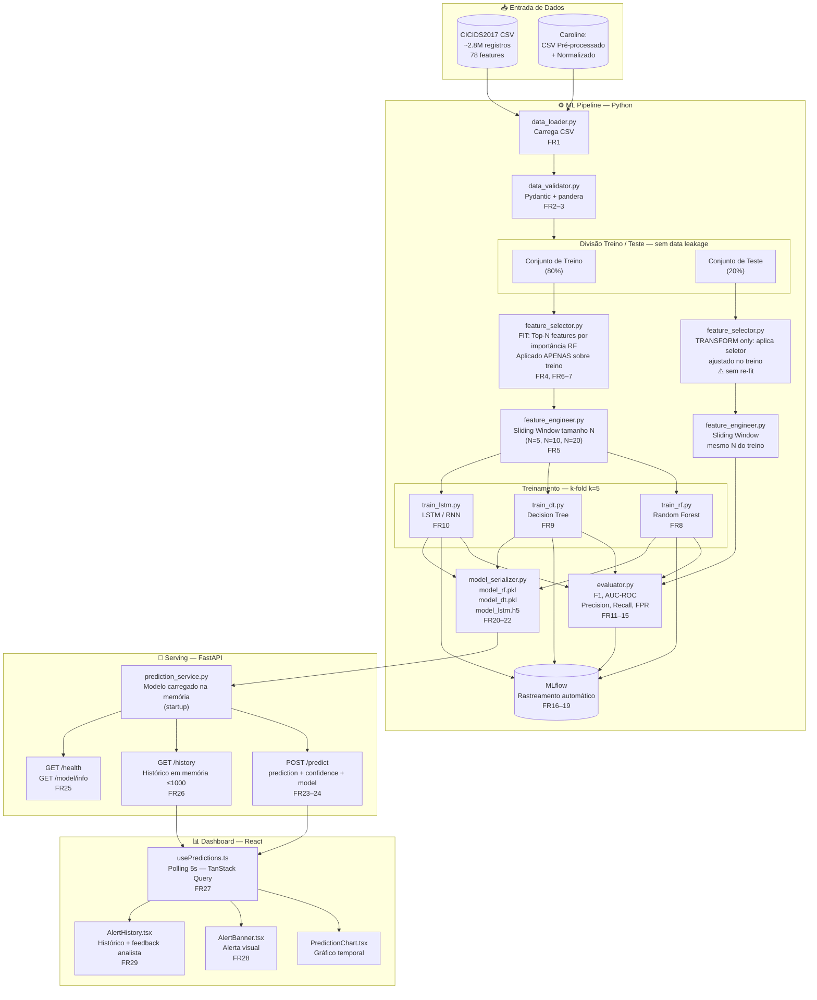
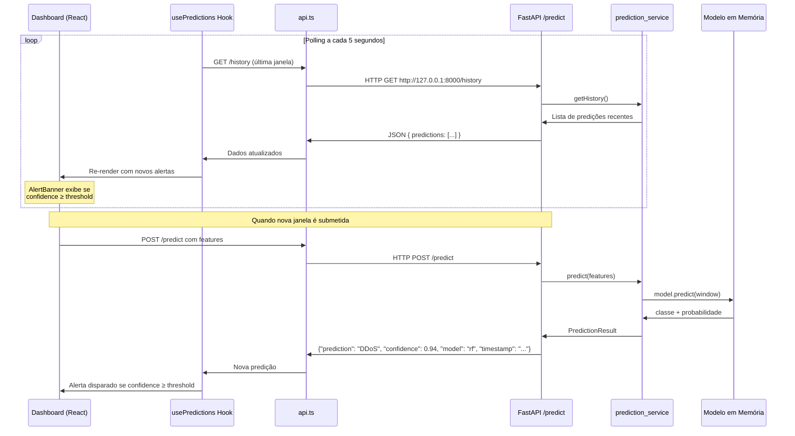

# Documento de Arquitetura e Planejamento Técnico
## Sistema de Previsão Antecipada de Ataques Cibernéticos com Machine Learning

---

| Campo | Informação |
|---|---|
| **Projeto** | IC — Machine Learning para Cibersegurança |
| **Instituição** | FCET — Faculdade de Ciências Exatas e Tecnologia |
| **Orientador** | Prof. Dr. Daniel Couto Gatti |
| **Autora principal** | Emili Vieira Tabuti |
| **Colaboradoras** | Caroline (Módulo de Dados), Isabela Groke Gomes (Módulo de Avaliação) |
| **Versão** | 1.3 |
| **Data** | Fevereiro de 2026 |
| **Status** | Aprovado para Implementação |

---

## Sumário

1. [Resumo Executivo](#1-resumo-executivo)
2. [Contexto e Motivação](#2-contexto-e-motivação)
3. [Visão Geral do Sistema](#3-visão-geral-do-sistema)
4. [Stack Tecnológico](#4-stack-tecnológico)
5. [Arquitetura dos Componentes](#5-arquitetura-dos-componentes)
6. [Diagrama de Fluxo de Dados](#6-diagrama-de-fluxo-de-dados)
7. [Feature Engineering e Seleção de Features](#7-feature-engineering-e-seleção-de-features)
8. [Design do Módulo de Predição](#8-design-do-módulo-de-predição)
9. [Mecanismo de Geração de Alertas](#9-mecanismo-de-geração-de-alertas)
10. [Arquitetura de Dados](#10-arquitetura-de-dados)
11. [Design de Interface (Frontend)](#11-design-de-interface-frontend)
12. [Contratos de Interface](#12-contratos-de-interface)
13. [Padrões de Implementação](#13-padrões-de-implementação)
14. [Segurança e Ambiente de Deploy](#14-segurança-e-ambiente-de-deploy)
15. [Reprodutibilidade Científica](#15-reprodutibilidade-científica)
16. [Análise de Riscos](#16-análise-de-riscos)
17. [Estrutura do Repositório](#17-estrutura-do-repositório)
18. [Trabalho Futuro](#18-trabalho-futuro)

---

## 1. Resumo Executivo

Este documento descreve a arquitetura técnica do sistema de **previsão antecipada de ataques cibernéticos** desenvolvido como Iniciação Científica no FCET. O sistema aplica algoritmos de Machine Learning — Random Forest (RF), Decision Tree (DT) e LSTM — sobre janelas temporais deslizantes de dados de tráfego de rede do dataset CICIDS2017, com o objetivo de **prever a ocorrência de ataques antes de sua concretização**, emitindo alertas com latência ≤ 10 segundos.

O projeto é conduzido por três pesquisadoras com escopos complementares:
- **Caroline:** coleta, limpeza e normalização do dataset CICIDS2017
- **Emili Vieira Tabuti:** implementação, treinamento e comparação dos modelos ML
- **Isabela Groke Gomes:** interface de visualização de alertas e avaliação em ambiente simulado

A arquitetura é composta por dois subsistemas principais integrados via REST API: um **ML Pipeline** (Python) responsável pelo treinamento, avaliação e serving do modelo, e um **Dashboard de Monitoramento** (React) responsável pela visualização de alertas em tempo real.

**Entregáveis científicos previstos:** artigo com comparação empírica de ≥ 3 algoritmos, relatório final de IC, e demonstração funcional em seminário.

---

## 2. Contexto e Motivação

### 2.1 Problema

Ferramentas tradicionais de detecção de intrusão (Snort, Suricata, SIEM) operam sobre **assinaturas fixas** e detectam ameaças somente após o início do ataque. Redes acadêmicas permanecem expostas a ataques zero-day e ameaças emergentes sem mecanismo de antecipação.

**O custo do paradigma reativo:** ao detectar um ataque em andamento, os dados já podem estar comprometidos. O analista age *após* o dano.

### 2.2 Proposta de Solução

Este trabalho aplica o paradigma de **previsão antecipada**: dado um histórico de janelas de tráfego de rede, estimar a probabilidade de ataque na janela seguinte. A abordagem utiliza *sliding window* sobre sequências de features temporais, habilitando modelos sequenciais (LSTM) e modelos tabulares (RF, DT) a identificar **padrões que precedem o ataque**, não apenas os que o caracterizam.

### 2.3 Diferencial em Relação à Literatura

A revisão bibliográfica de 14 papers (2017–2025) confirma: todos os trabalhos revisados focam em **detecção** (classificação de tráfego em andamento). Nenhum aplica *sliding window* para **previsão** com comparação empírica entre LSTM e ML tradicional. Este trabalho produz evidência científica inédita nesse recorte.

> **Referências-chave da literatura:** Yin et al. (2017) — RNN-IDS (mais próximo, mas para detecção); Ennaji et al. (2025) — menciona previsão de comportamento como direção futura de pesquisa.

### 2.4 Usuário-Alvo

Analista de segurança em redes acadêmicas que necessita de **alertas proativos** — não reativos — para agir antes da concretização de um ataque. Critérios de sucesso do usuário:

- Alerta emitido *antes* da concretização do ataque
- Latência do alerta ≤ 10 segundos
- Taxa de falsos positivos ≤ 10%

---

## 3. Visão Geral do Sistema

### 3.1 Componentes Principais

O sistema é composto por **três módulos interdependentes**:

```
┌─────────────────────────────────────────────────────────────┐
│                     Sistema Completo                        │
│                                                             │
│  ┌───────────────┐    ┌───────────────┐    ┌─────────────┐ │
│  │  ML Pipeline  │───▶│  FastAPI      │───▶│  Dashboard  │ │
│  │  (Python)     │    │  REST API     │    │  (React)    │ │
│  │  Emili        │    │  Emili        │    │  Isabela    │ │
│  └───────────────┘    └───────────────┘    └─────────────┘ │
│         ▲                                                   │
│         │                                                   │
│  ┌───────────────┐                                          │
│  │  Dados        │                                          │
│  │  CICIDS2017   │                                          │
│  │  Caroline     │                                          │
│  └───────────────┘                                          │
└─────────────────────────────────────────────────────────────┘
```

| Módulo | Responsável | Tecnologia | Função |
|---|---|---|---|
| Preparação de Dados | Caroline | Python, pandas | Coleta, limpeza e normalização do CICIDS2017 |
| ML Pipeline | Emili | Python, scikit-learn, Keras, MLflow | Feature selection, treinamento, avaliação, serving |
| Dashboard | Isabela | React, TypeScript, Recharts | Visualização de alertas e histórico |

### 3.2 Premissas Arquiteturais

1. **Ambiente local:** o sistema opera exclusivamente em `localhost` — sem deploy em nuvem ou autenticação complexa
2. **Dataset estático:** CICIDS2017 é processado em batch — sem ingestão de tráfego em tempo real
3. **Escopo acadêmico:** complexidade de infraestrutura proporcional ao prazo e objetivo científico
4. **Reprodutibilidade por design:** seed global fixo em todos os componentes com aleatoriedade

---

## 4. Stack Tecnológico

### 4.1 Visão Consolidada

| Camada | Tecnologia | Versão | Justificativa |
|---|---|---|---|
| **Linguagem ML** | Python | ≥ 3.10 | Ecossistema ML mais maduro; compatibilidade com scikit-learn, TensorFlow e MLflow |
| **ML — Modelos Clássicos** | scikit-learn | 1.4.x | Implementações de referência para RF e DT; integração nativa com MLflow e joblib |
| **ML — Deep Learning** | TensorFlow / Keras | 2.x | Framework consolidado para LSTM; suporte a GPU no Colab; autolog MLflow nativo |
| **Rastreamento de Experimentos** | MLflow | 2.x | Padrão de mercado para experiment tracking; UI local; exportação CSV; autolog zero-config |
| **Serialização de Modelos** | joblib (sklearn) / HDF5 (Keras) | 1.3.x / nativo | joblib serializa Pipeline completo (scaler + encoder + modelo); HDF5 é padrão Keras |
| **API de Serving** | FastAPI | 0.110.x | Assíncrono, validação Pydantic nativa, documentação `/docs` automática, alta performance |
| **Servidor WSGI** | uvicorn | 0.29.x | Servidor ASGI de referência para FastAPI; configuração simples |
| **Validação de Dados** | Pydantic + pandera | 2.x / 0.20.x | Pydantic integrado ao FastAPI; pandera para validação de DataFrames em pipeline |
| **Frontend** | React + TypeScript | 18.x / 5.x | Biblioteca UI mais utilizada; TypeScript adiciona segurança de tipos |
| **Build Frontend** | Vite | 5.x | HMR nativo, ESM, build otimizado — padrão para projetos React modernos |
| **Estilo** | Tailwind CSS + shadcn/ui | 3.x / latest | Utilitário CSS de alta produtividade; shadcn oferece componentes copiáveis e acessíveis |
| **Gráficos** | Recharts | 2.x | Biblioteca React-native para charts; leve, responsiva e bem documentada |
| **Server State** | TanStack Query | 5.x | Polling automático, cache, loading/error states — elimina boilerplate de fetch |
| **Ambiente de Notebooks** | Jupyter Notebook | latest | Exploração interativa e prototipagem de modelos |
| **GPU (opcional)** | Google Colab | — | GPU T4 gratuita para treino LSTM quando CPU local for insuficiente |

### 4.2 Decisões de Descarte Justificadas

#### Plataforma de Streaming (Apache Kafka / Apache Flink / Spark Streaming)
**Decisão:** Não utilizar. \
**Justificativa:** Plataformas de streaming são projetadas para ingestão contínua de múltiplas fontes com milhões de eventos por segundo. Para esta IC:
- O CICIDS2017 é um dataset **estático** — processado em batch
- A demonstração usa **replay de dados históricos**, não captura de tráfego real
- O ambiente é **local e single-node** — sem necessidade de infraestrutura distribuída
- O overhead de setup (brokers Kafka, Zookeeper) seria desproporcional ao benefício científico

A abordagem adotada — **sliding window batch + polling REST a cada 5s** — entrega o mesmo comportamento observável ao usuário com complexidade adequada ao prazo e à natureza acadêmica do projeto.

#### Banco de Dados Relacional (PostgreSQL / SQLite)
**Decisão:** Não utilizar. \
**Justificativa:**
- O histórico de alertas não precisa sobreviver entre reinicializações (escopo de demonstração)
- Os dados de treino são estáticos — não requerem SGBD
- O rastreamento de experimentos é coberto integralmente pelo MLflow
- Ambiente local sem múltiplos usuários ou concorrência

> **Evolução natural pós-IC:** SQLite para histórico de alertas; PostgreSQL para deploy multi-usuário em produção.

#### SVM (Support Vector Machine)
**Decisão:** Removido do escopo. \
**Justificativa:** Menor contribuição científica diferencial frente a RF, DT e LSTM no paradigma de previsão com sliding window. A remoção libera tempo de implementação e análise sem comprometer as afirmações científicas do artigo.

---

## 5. Arquitetura dos Componentes

### 5.1 Componente A — ML Pipeline (Python)

Responsável pelo ciclo completo de ciência de dados: ingestão, feature engineering, treinamento, avaliação e serving.

**Subcomponentes:**

| Subcomponente | Módulo | Responsabilidade |
|---|---|---|
| Data Loader | `src/data/data_loader.py` | Carrega CSV, valida schema contra contrato formal |
| Data Validator | `src/data/data_validator.py` | Validação Pydantic + pandera (tipos, nulos, colunas) |
| Feature Engineer | `src/features/feature_engineer.py` | Sliding window de tamanho N configurável |
| Feature Selector | `src/features/feature_selector.py` | Top-N features por importância RF ou correlação |
| Model Trainers | `src/training/train_rf.py`, `train_dt.py`, `train_lstm.py` | Treino independente por algoritmo com MLflow autolog |
| Evaluator | `src/training/evaluator.py` | k-fold k=5, métricas F1/AUC-ROC/Precision/Recall/FPR |
| Model Serializer | `src/models/model_serializer.py` | Serializa pipeline completo (scaler + encoder + modelo) |
| Prediction Service | `src/api/services/prediction_service.py` | Carrega artefato e executa inferência |
| FastAPI App | `src/api/main.py` | Endpoints REST, CORS, startup, tratamento de erros |

**Decisão de scripts separados por modelo:**
Cada algoritmo tem seu próprio script de treino (`train_rf.py`, `train_dt.py`, `train_lstm.py`). Essa separação favorece **clareza científica** e **debugabilidade individual** — cada run é independente e rastreável no MLflow sem acoplamento entre os experimentos.

### 5.2 Componente B — Dashboard de Monitoramento (React)

Interface de visualização para o analista de segurança.

**Subcomponentes:**

| Subcomponente | Arquivo | Responsabilidade |
|---|---|---|
| API Client | `src/services/api.ts` | **Único ponto de acesso** à FastAPI — sem fetch direto em componentes |
| Predictions Hook | `src/hooks/usePredictions.ts` | Polling 5s via TanStack Query — atualiza dashboard sem reload |
| Alerts Hook | `src/hooks/useAlerts.ts` | Filtra predições pelo threshold de confiança configurável |
| Prediction Chart | `src/components/charts/PredictionChart.tsx` | Gráfico temporal de predições (Recharts) |
| Metric Card | `src/components/cards/MetricCard.tsx` | Card de métrica (4× no Monitor): alertas ativos, janelas analisadas, precisão, latência |
| Model Info Card | `src/components/cards/ModelInfoCard.tsx` | Exibe metadados do modelo ativo (tipo, versão, número de features) — consome `GET /model/info` |
| Alert Banner | `src/components/alerts/AlertBanner.tsx` | Alerta visual com tipo, confiança e timestamp |
| Alert List | `src/components/alerts/AlertList.tsx` | Lista de alertas pendentes com filtro e seleção |
| Alert Detail Panel | `src/components/alerts/AlertDetailPanel.tsx` | Painel inline com detalhe do alerta selecionado |
| Confidence Gauge | `src/components/charts/ConfidenceGauge.tsx` | Medidor circular da confiança — renderizado dentro do `AlertDetailPanel` |
| Feature Explainer | `src/components/features/FeatureExplainer.tsx` | Top 3 features com nome, valor observado e delta vs. baseline |
| Alert History | `src/components/alerts/AlertHistory.tsx` | Histórico paginado com feedback do analista |
| Model Comparison Table | `src/components/models/ModelComparisonTable.tsx` | Tabela comparativa RF/DT/LSTM com métricas |
| Demo Mode Controls | `src/components/models/DemoModeControls.tsx` | Controles do modo demo para apresentação em seminário |
| Dashboard Page | `src/pages/Dashboard.tsx` | Composição da página principal (4 seções: Monitor, Alertas, Histórico, Modelos) |

### 5.3 Interação Entre Componentes

```
[ML Pipeline] → serializa modelo → [models/*.pkl/.h5]
                                          ↓
                            [prediction_service.py] carrega na inicialização
                                          ↓
                              [FastAPI] expõe REST API
                                          ↓
                        [api.ts] consome via HTTP (polling 5s)
                                          ↓
                      [usePredictions + TanStack Query] gerencia estado
                                          ↓
                    [Dashboard.tsx] renderiza alertas e gráficos
```

---

## 6. Diagrama de Fluxo de Dados

### 6.1 Fluxo Completo — Treinamento a Inferência



### 6.2 Fluxo de Inferência em Tempo Real



### 6.3 Fluxo de Treinamento (Offline)

```
[CICIDS2017 CSV] → Carregamento + Validação de Schema
                → Divisão Train/Test (sem leakage)
                → Feature Selection (sobre treino apenas)
                → Sliding Window (separado: treino e teste)
                → Treino paralelo: RF | DT | LSTM
                → Avaliação: k-fold k=5 por modelo
                → MLflow: log de parâmetros + métricas de todos os runs
                → Comparação visual no MLflow UI
                → Seleção do modelo vencedor
                → Serialização: pipeline completo → .pkl / .h5
                → Disponível para FastAPI no startup
```

---

## 7. Feature Engineering e Seleção de Features

### 7.1 Dataset Base — CICIDS2017

| Característica | Valor |
|---|---|
| Registros | ~2,8 milhões |
| Features originais | 78 |
| Coluna label | `Label` (BENIGN + categorias de ataque) |
| Tipos de ataque cobertos | DoS, DDoS, Brute Force, SQL Injection, XSS, Infiltration, Botnet, PortScan |
| Origem | Canadian Institute for Cybersecurity — dataset público |
| Pré-processamento | Executado por Caroline (normalização, remoção de duplicatas, limpeza) |

### 7.2 Pipeline de Feature Engineering

```
Dados brutos (78 features) 
    ↓ 
[1] Divisão Train/Test — antes de qualquer transformação (FR3)
    ↓ 
[2] Feature Selection sobre treino (FR4, FR6)
    → Método: RF Feature Importance + Correlação com label
    → Saída: Top-N features (N configurável)
    → Anti-pattern evitado: nunca executar com visibilidade do test set
    ↓ 
[3] Sliding Window sobre treino e teste separadamente (FR5, FR6)
    → Parâmetro: tamanho N ∈ {5, 10, 20}
    → Cria contexto temporal para cada amostra
    → Anti-pattern evitado: janelas de teste não incluem amostras do treino
    ↓ 
[4] Conjunto pronto para treinamento dos modelos
```

### 7.3 Método de Seleção de Features

**Fase 1 — Análise de Importância por RF:**
- Treinar um Random Forest auxiliar sobre o conjunto de treino
- Extrair `feature_importances_` para todas as 78 features
- Ordenar por importância decrescente

**Fase 2 — Análise de Correlação:**
- Calcular matriz de correlação de Pearson entre features e label
- Identificar features redundantes (correlação mútua > threshold)

**Fase 3 — Seleção Final:**
- Combinar os dois critérios (importância ≥ threshold E correlação com label ≥ threshold)
- Definir N (top-N features) experimentalmente — testar N = 10, 20, 30
- Documentar conjunto final para o artigo

> **Nota:** O conjunto final de features será documentado aqui após a execução experimental — depende da entrega do dataset normalizado por Caroline (marco: semana 7).

### 7.4 Sliding Window — Justificativa

A sliding window transforma o problema de **classificação estática** (cada fluxo independente) em um problema de **série temporal** (contexto de N fluxos anteriores). Isso é fundamental para o paradigma de *previsão antecipada*: o modelo aprende padrões de transição que precedem o ataque, não apenas features instantâneas do ataque em si.

| Parâmetro | Valores a Testar | Impacto |
|---|---|---|
| Tamanho N | 5, 10, 20 | Janelas maiores capturam mais contexto temporal; janelas menores são mais sensíveis a variações rápidas |
| Stride | 1 (padrão) | Máxima granularidade temporal |

O valor ótimo de N será reportado no artigo como análise de sensibilidade.

---

## 8. Design do Módulo de Predição

### 8.1 Modelos Implementados

#### 8.1.1 Random Forest (RF)

| Aspecto | Especificação |
|---|---|
| **Biblioteca** | scikit-learn `RandomForestClassifier` |
| **Serialização** | `joblib` — sklearn Pipeline completo (scaler + selector + modelo) |
| **Vantagens** | Alta interpretabilidade (feature importances), robusto a outliers, sem normalização obrigatória, rápido em CPU |
| **Limitações** | Trata cada janela de forma independente — não captura sequencialidade temporal |
| **Hiperparâmetros-chave** | `n_estimators`, `max_depth`, `min_samples_split`, `random_state=42` |
| **Artefato** | `models/model_rf.pkl` |

#### 8.1.2 Decision Tree (DT)

| Aspecto | Especificação |
|---|---|
| **Biblioteca** | scikit-learn `DecisionTreeClassifier` |
| **Serialização** | `joblib` — sklearn Pipeline completo |
| **Vantagens** | Máxima interpretabilidade (árvore visualizável), baseline simples e explicável |
| **Limitações** | Propenso a overfitting sem poda; sem memória temporal |
| **Hiperparâmetros-chave** | `max_depth`, `criterion`, `min_samples_leaf`, `random_state=42` |
| **Artefato** | `models/model_dt.pkl` |

#### 8.1.3 LSTM (Long Short-Term Memory)

| Aspecto | Especificação |
|---|---|
| **Biblioteca** | TensorFlow / Keras |
| **Serialização** | Formato `.h5` (HDF5) — modelo Keras completo com pesos |
| **Vantagens** | Captura dependências temporais de longa distância — vantagem estrutural no paradigma de previsão com sliding window |
| **Limitações** | Maior custo computacional; treino recomendado no Google Colab (GPU T4) |
| **Hiperparâmetros-chave** | `units`, `dropout`, `learning_rate`, `batch_size`, `epochs`, `tf.random.set_seed(42)` |
| **Artefato** | `models/model_lstm.h5` |
| **Alternativa** | MLP (`Dense` layers) se LSTM for inviável no prazo |

### 8.2 Protocolo de Avaliação

Todos os modelos são avaliados nas **mesmas condições**:

| Critério | Especificação |
|---|---|
| **Validação** | k-fold cross-validation, k=5 |
| **Reportado** | Média ± desvio padrão de cada métrica entre os 5 folds |
| **Métricas** | F1-Score, AUC-ROC, Precision, Recall, False Positive Rate (FPR) |
| **Split** | Mesmo split treino/teste para todos os modelos |
| **Features** | Mesmo conjunto de features selecionadas |
| **Janela** | Mesmo valor de N para todos os modelos |

**Metas de performance:**

| Métrica | Meta Mínima |
|---|---|
| Precision | ≥ 90% |
| Recall | ≥ 85% |
| F1-Score | Maximizar |
| AUC-ROC | ≥ 0.90 |
| False Positive Rate | ≤ 10% |

### 8.3 Rastreamento de Experimentos (MLflow)

Cada run de treinamento registra automaticamente via `mlflow.sklearn.autolog()` e `mlflow.tensorflow.autolog()`:

- **Parâmetros:** algoritmo, hiperparâmetros, `window_size`, `n_features`, `k_fold`, `random_seed`
- **Métricas:** F1, AUC-ROC, Precision, Recall, FPR (média e desvio padrão dos folds)
- **Artefatos:** modelo serializado, matriz de confusão, curva ROC
- **Nomenclatura de experimentos:** `ic-ml-cybersecurity-{model_type}` (ex: `ic-ml-cybersecurity-rf`)

Comparação visual entre os modelos disponível em `mlflow ui` (porta 5000 local). Resultados exportáveis como CSV para o artigo.

### 8.4 Serialização do Artefato de Modelo

O artefato de modelo exportado é **auto-suficiente**: inclui todo o pipeline de pré-processamento necessário para inferência, sem dependência do código-fonte de treinamento.

```
sklearn Pipeline (RF / DT):
└── step_1: MinMaxScaler (normalização)
└── step_2: FeatureSelector (top-N features pré-selecionadas)
└── step_3: RandomForestClassifier / DecisionTreeClassifier

Keras Model (LSTM):
└── Pesos + arquitetura (model.save('model_lstm.h5'))
└── Scaler separado: scaler_lstm.pkl
└── Encoder separado: encoder_lstm.pkl
```

---

## 9. Mecanismo de Geração de Alertas

### 9.1 Visão Geral do Fluxo de Alertas

```
[Janela de tráfego N registros]
        ↓
[POST /predict] — FastAPI recebe features pré-processadas
        ↓
[prediction_service.predict(features)]
        ↓
[modelo.predict_proba(X)] → classe + probabilidade (confiança)
        ↓
[Resposta JSON: prediction + confidence + model + timestamp]
        ↓
[Armazenado em histórico em memória (≤ 1000 entradas)]
        ↓
[Dashboard: polling 5s via TanStack Query]
        ↓
[confidence ≥ threshold configurável?]
    ├── Sim → AlertBanner disparado + entrada no histórico
    └── Não → exibido no gráfico apenas (sem alerta crítico)
```

### 9.2 API de Predição

#### Endpoints Definidos

| Método | Path | Arquivo de rota | Descrição | FR |
|---|---|---|---|---|
| `POST` | `/predict` | `routes/predict.py` | Recebe features de janela, retorna predição + confiança | FR23–24 |
| `POST` | `/mock/predict` | `routes/predict.py` | Respostas fixas para desenvolvimento paralelo do dashboard | FR26 |
| `GET` | `/history` | `routes/history.py` | Histórico de predições em memória | FR26 |
| `GET` | `/health` | `routes/health.py` | Status da API e modelo carregado | FR25 |
| `GET` | `/model/info` | `routes/health.py` | Metadados do modelo ativo (tipo, versão, features) | FR25 |
| `GET` | `/docs` | FastAPI (automático) | Documentação interativa Swagger UI | FR25 |

#### Contrato da API — `POST /predict`

**Request:**
```json
{
  "features": [0.12, 0.87, 0.34, 0.56, ...],
  "window_size": 10,
  "timestamp": "2026-02-21T14:00:00Z"
}
```

**Response (200 OK):**
```json
{
  "prediction": "DDoS",
  "confidence": 0.94,
  "model": "random_forest",
  "timestamp": "2026-02-21T14:00:00Z",
  "is_attack": true
}
```

**Response (erro — 422 Unprocessable Entity):**
```json
{
  "detail": "Número de features inválido. Esperado: 20, recebido: 15.",
  "code": "INVALID_FEATURES"
}
```

### 9.3 Configuração do Threshold de Alertas

O threshold de confiança mínimo para disparo de alertas é configurável pelo analista via interface ou variável de ambiente:

| Parâmetro | Padrão | Descrição |
|---|---|---|
| `CONFIDENCE_THRESHOLD` | `0.80` | Predições com confiança ≥ 80% disparam alerta visual |
| `POLLING_INTERVAL_MS` | `5000` | Intervalo de polling do dashboard (millisegundos) |
| `MAX_HISTORY_SIZE` | `1000` | Máximo de predições mantidas em memória |

### 9.4 Interface de Alertas (Dashboard)

**Componentes de alerta:**

| Componente | Seção | Função |
|---|---|---|
| `MetricCard.tsx` | Monitor (4×) | Cards de métricas do header: alertas ativos, janelas analisadas, precisão corrente, latência da API |
| `PredictionChart.tsx` | Monitor | Gráfico temporal com linha de confiança — visualiza tendência ao longo do tempo |
| `AlertBanner.tsx` | Monitor / Alertas | Banner visual de destaque quando `is_attack = true` e `confidence ≥ threshold` |
| `AlertList.tsx` | Alertas | Lista filtrável de alertas pendentes; seleção de item abre `AlertDetailPanel` inline |
| `AlertDetailPanel.tsx` | Alertas | Painel de detalhe inline do alerta selecionado — agrega `ConfidenceGauge` + `FeatureExplainer` |
| `ConfidenceGauge.tsx` | Painel de detalhe | Medidor circular da confiança da predição atual |
| `FeatureExplainer.tsx` | Painel de detalhe | **Top 3 features de tráfego** que motivaram a predição — nome em `JetBrains Mono` + valor observado + delta vs. baseline. Componente central de transparência e confiança do analista |
| `AlertHistory.tsx` | Histórico | Tabela com histórico das últimas ≥ 100 predições; permite confirmar ou descartar |
| `ModelComparisonTable.tsx` | Modelos | Tabela comparativa RF × DT × LSTM com métricas, highlight do melhor modelo e exportação CSV (FR14, FR33) |
| `DemoModeControls.tsx` | Modelos | Controles de replay de sessão histórica para demonstração no seminário |

**Informações exibidas no painel de detalhe do alerta:**
- Tipo de ameaça prevista (ex: "DDoS", "Brute Force SSH")
- Nível de confiança do modelo (0–100%)
- Timestamp da janela de tráfego analisada
- Identificador do modelo que gerou a predição
- **Top 3 features** com maior peso na predição (via `FeatureExplainer`)
- Status: Pendente / Confirmado pelo analista / Descartado como falso positivo
- Ação "desfazer" disponível por 5 segundos via toast após decisão

**Navegação do Dashboard (4 seções):**

| Seção | Componentes principais | Função |
|---|---|---|
| **Monitor** | `PredictionChart`, `AlertBanner`, 4× `MetricCard` | Estado em tempo real — alertas ativos, janelas analisadas, precisão, latência |
| **Alertas** | `AlertList`, `AlertDetailPanel` + `FeatureExplainer` | Lista de alertas pendentes + painel de detalhe inline |
| **Histórico** | `AlertHistory` | Alertas tratados com timeline e status |
| **Modelos** | `ModelComparisonTable`, `DemoModeControls` | Comparação RF/DT/LSTM + modo demo para seminário |

> **Nota sobre `SlidingWindowChart`:** A UX Spec define este componente (visualização da janela temporal que gerou o alerta) como item da Fase 2. **Decisão:** implementado como pós-MVP — não bloqueia nenhum FR obrigatório. Pode ser adicionado como melhoria após a entrega principal.

---

## 10. Arquitetura de Dados

### 10.1 Fluxo de Dados — Fases

| Fase | Dados | Formato | Responsável |
|---|---|---|---|
| Raw | CICIDS2017 original | CSV (~2.8M registros, 78 features) | Público |
| Processed | CSV normalizado | CSV (Min-Max ou Z-score, definido por Caroline) | Caroline |
| Features Selected | Subconjunto de features | Em memória (pandas DataFrame) | Emili |
| Windowed | Janelas de N registros | Numpy array 3D (samples × N × features) | Emili |
| Model Input | Batch pronto para treino | Numpy array | Emili |
| Model Artifact | Modelo serializado | `.pkl` (RF/DT) ou `.h5` (LSTM) | Emili |
| Prediction | Resposta da API | JSON | FastAPI |
| Alert History | Predições recentes | Lista em memória (≤ 1000) | FastAPI |

### 10.2 Decisão de Ausência de Banco de Dados

**Decisão:** Nenhum banco de dados relacional. \
**Racional detalhado:**

1. O histórico de alertas **não precisa sobreviver** entre reinicializações — escopo de demonstração científica
2. Os dados de treino são **estáticos** — CICIDS2017 não é atualizado em tempo real
3. O rastreamento de experimentos é coberto **integralmente** pelo MLflow (substitui necessidade de DB para métricas)
4. Ambiente **local, single-user, sem concorrência** — sobrecarga de SGBD não justificada

> **Caminho de evolução:** se o sistema evoluir para produção real com múltiplos analistas, a adição de SQLite (histórico de alertas) e PostgreSQL (multi-usuário) seriam as evoluções naturais e de baixo impacto na arquitetura existente.

### 10.3 Localização dos Dados no Repositório

```
ml-pipeline/
├── data/
│   ├── raw/          # CICIDS2017 original — NÃO commitado (.gitignore)
│   ├── processed/    # CSV normalizado por Caroline — NÃO commitado
│   └── schema/
│       └── features_schema.json   # Contrato formal Caroline ↔ Emili
├── models/
│   ├── model_rf.pkl
│   ├── model_dt.pkl
│   └── model_lstm.h5
└── mlruns/           # MLflow tracking — NÃO commitado
```

---

## 11. Design de Interface (Frontend)

Esta seção documenta as decisões arquiteturais da camada de apresentação — constraints de design que orientam toda a implementação do componente React.

### 11.1 Sistema de Cores

**Filosofia:** Cores funcionais, não decorativas. Cada cor carrega significado preciso — o analista decifra o estado do sistema instantaneamente.

**Backgrounds (tokens Tailwind customizados):**

| Token | Hex | Uso |
|---|---|---|
| `bg-base` | `#0F1117` | Fundo principal da aplicação |
| `bg-surface` | `#1A1D27` | Cards, painéis, sidebar |
| `bg-elevated` | `#242736` | Modais, tooltips, hover states |
| `border` | `#2E3147` | Bordas sutis entre elementos |

**Paleta semântica — significado de negócio:**

| Token | Hex | Significado |
|---|---|---|
| `critical` | `#EF4444` | Alerta crítico — alta confiança de ataque iminente |
| `warning` | `#F59E0B` | Alerta suspeito — confiança moderada |
| `safe` | `#10B981` | Estado seguro — sem alertas ativos |
| `info` | `#3B82F6` | Informacional — dados de modelo, métricas |
| `muted` | `#6B7280` | Texto secundário, labels, timestamps |

**Texto:**

| Token | Hex | Uso |
|---|---|---|
| `text-primary` | `#F1F5F9` | Títulos, alertas, informação crítica |
| `text-secondary` | `#94A3B8` | Labels, descrições, metadados |
| `text-code` | `#7DD3FC` | IPs, valores de features, dados técnicos |

### 11.2 Sistema de Tipografia

| Fonte | Uso | Justificativa |
|---|---|---|
| **Inter** (Regular 400, Medium 500, SemiBold 600) | Interface geral — títulos, labels, botões | Legibilidade em painéis densos; padrão de ferramentas de monitoramento |
| **JetBrains Mono** | Dados técnicos — IPs, timestamps, features de tráfego, valores numéricos | Diferencia visualmente dado técnico de texto de interface; facilita leitura de valores alinhados |

**Escala tipográfica:** 12px (labels) → 13px (body) → 16px (h3) → 20px (h2) → 28px (h1 dashboard)

### 11.3 Layout e Estrutura

**Decisão de layout:** Command Center (Direção A) — escolhida sobre Split Focus, Minimal Alert e Scientific pela familiaridade com ferramentas SIEM (Grafana/Kibana) do perfil de usuário.

```
┌─────────────────────────────────────────────────────────┐
│  Header fixo: 4× MetricCard (alertas | janelas | precisão | latência) │
├──────────┬──────────────────────────────────────────────┤
│          │  [conteúdo da seção ativa]                   │
│ Sidebar  │                                              │
│  220px   │  → Monitor: PredictionChart + AlertBanner    │
│  fixa    │  → Alertas: AlertList + AlertDetailPanel     │
│          │  → Histórico: AlertHistory + timeline        │
│  Nav:    │  → Modelos: ModelComparisonTable + DemoMode  │
│ Monitor  │                                              │
│ Alertas  │                                              │
│ Histórico│                                              │
│ Modelos  │                                              │
└──────────┴──────────────────────────────────────────────┘
```

> **Decisão registrada — largura da sidebar:** **220px** (não 240px). A seção "Spacing & Layout" da UX Spec menciona 240px por erro; a seção "Implementation Approach" e os épicos usam 220px consistentemente. **Valor definido: 220px.**

**Responsividade:** Desktop-first (workstation de laboratório). Sidebar colapsável em telas < 1024px.

### 11.4 Acessibilidade (WCAG AA)

Requisitos arquiteturais de acessibilidade — não opcionais:

| Requisito | Implementação |
|---|---|
| Contraste mínimo 4.5:1 | `text-primary` (#F1F5F9) sobre `bg-base` (#0F1117) = 14.5:1 (nível AAA) |
| Severidade nunca apenas por cor | Cada nível de severidade acompanhado de ícone + label textual (ex: 🔴 "Crítico") |
| Alertas dinâmicos anunciados | `aria-live="polite"` no container de novos alertas — leitores de tela anunciam chegada |
| Badge de contagem | Atualizar `document.title` com contagem de alertas ativos (ex: `"(3) ic-ml-cybersecurity"`) |
| Ações acessíveis via teclado | Botões "Confirmar" / "Falso Positivo" navegáveis por Tab + Enter |

---

## 12. Contratos de Interface

### 12.1 Contrato de Dados — Caroline → Emili

Acordo formal sobre o formato dos dados entregues por Caroline para o pipeline de Emili.

| Campo | Especificação |
|---|---|
| **Formato de entrega** | Parquet (`.parquet`) — adotado por Emili em substituição ao CSV planejado originalmente para melhor performance de I/O e preservação de tipos |
| **Encoding** | UTF-8 (campos string) |
| **Features** | Subconjunto das 78 features originais do CICIDS2017 (após normalização por Caroline) |
| **Nomenclatura** | Nomes originais do CICIDS2017 em snake_case (ex: `Flow_Duration`, `Total_Fwd_Packets`) |
| **Coluna label** | `Label` — valores: `BENIGN` + categorias de ataque em string |
| **Coluna binária** | `Binary_Label` — `0` = benigno, `1` = ataque (gerada pelo pipeline de Emili) |
| **Encoding de labels** | Strings (ex: `"DDoS"`, `"BENIGN"`) — encoding numérico é responsabilidade de Emili |
| **Valores nulos** | Tratados no pipeline Emili (`cleaner.py`: `fillna(0)` após `replace([inf, -inf], nan)`) |
| **Duplicatas** | Removidas no pipeline Emili (`cleaner.py`: `drop_duplicates()`) |
| **Normalização** | `log1p` em features assimétricas + `RobustScaler` (usa mediana+IQR, robusto a outliers) |
| **Arquivo de contrato** | `data/schema/features_schema.json` |

> **📌 Decisão registrada (2026-03-06):** O pipeline de pré-processamento foi implementado por Emili em `src/data/pipeline/` (`collector.py`, `cleaner.py`, `scaler.py`, `preprocessor.py`) em vez de receber o CSV pré-processado de Caroline. Motivação: (1) necessidade de controle total sobre o pipeline para reprodutibilidade científica; (2) suporte expandido para UNSW-NB15 como segundo dataset de validação (não previsto no PRD original, adicionado como melhoria). O formato Parquet foi preferido ao CSV por performance (~10x mais rápido para leitura, preservação nativa de tipos). Os arquivos intermediários seguem a cadeia: `*_raw_merged.parquet` → `*_cleaned.parquet` → `*_scaled.parquet` → `*_model_ready_binary.parquet` + `*_model_ready_attacktype.parquet`.

> **Datasets suportados:** CIC-IDS2017 (escopo principal do PRD) e UNSW-NB15 (adição de Emili para análise comparativa no artigo).

### 12.2 Contrato REST — FastAPI → Dashboard (React)

Schema Pydantic em `src/api/schemas/prediction.py` espelhado como interface TypeScript em `dashboard/src/types/api.ts`.

**Campos garantidos em todos os campos ausentes:** `null` explícito — nunca omitir campo esperado.

**Timestamps:** sempre ISO 8601 (`"2026-02-21T14:00:00Z"`).

**Campos JSON:** sempre `snake_case` (ex: `"confidence_score"`, `"model_type"`, `"is_attack"`).

### 12.3 Contrato de Modelo — Treino → Serving

O artefato serializado deve satisfazer:
- Carregável em ambiente limpo sem código-fonte de treino (`joblib.load()` / `keras.models.load_model()`)
- Pipeline completo embutido: scaler + feature selector + modelo
- `MODEL_PATH` configurável via `config.py` e `.env`

---

## 13. Padrões de Implementação

### 13.1 Convenções de Nomenclatura

**Python:**

| Tipo | Padrão | Exemplos |
|---|---|---|
| Arquivos | `snake_case` | `train_rf.py`, `data_loader.py`, `feature_engineer.py` |
| Classes | `PascalCase` | `FeatureEngineer`, `ModelTrainer`, `PredictionService` |
| Funções e variáveis | `snake_case` | `load_dataset()`, `random_seed`, `window_size` |
| Constantes | `UPPER_SNAKE_CASE` | `RANDOM_SEED`, `WINDOW_SIZE`, `MODEL_PATH` |

**React/TypeScript:**

| Tipo | Padrão | Exemplos |
|---|---|---|
| Componentes (arquivo) | `PascalCase` | `AlertCard.tsx`, `PredictionChart.tsx` |
| Hooks e utilitários | `camelCase` | `usePredictions.ts`, `apiClient.ts` |
| Variáveis e funções | `camelCase` | `isLoading`, `fetchPredictions()` |

**API (JSON):** sempre `snake_case` — `"confidence_score"`, `"model_type"`, `"is_attack"`.

### 13.2 Tratamento de Erros

**Python — exceções tipadas por domínio:**
```python
class PredictionError(Exception): ...
class ModelNotLoadedError(Exception): ...
class InvalidFeaturesError(Exception): ...
```

**FastAPI — handler global:**
```python
@app.exception_handler(PredictionError)
async def prediction_error_handler(request, exc):
    return JSONResponse(status_code=500, content={
        "detail": str(exc), 
        "code": "PREDICTION_ERROR"
    })
```

**HTTP Status Codes:**

| Situação | Código |
|---|---|
| Sucesso | `200 OK` |
| Erro de validação | `422 Unprocessable Entity` (padrão FastAPI) |
| Erro interno | `500 Internal Server Error` |

### 13.3 Configuração Centralizada

**Python — `config.py`:**
```python
RANDOM_SEED = int(os.getenv("RANDOM_SEED", 42))
WINDOW_SIZE = int(os.getenv("WINDOW_SIZE", 10))
CONFIDENCE_THRESHOLD = float(os.getenv("CONFIDENCE_THRESHOLD", 0.80))
MODEL_PATH = os.getenv("MODEL_PATH", "models/model_rf.pkl")
```

**React — `src/config.ts`:**
```typescript
export const POLLING_INTERVAL_MS = 5000;
export const API_BASE_URL = import.meta.env.VITE_API_URL ?? "http://127.0.0.1:8000";
export const CONFIDENCE_THRESHOLD = 0.80;
```

### 13.4 Anti-Patterns a Evitar

| Anti-pattern | Alternativa Correta |
|---|---|
| `fetch('/predict', ...)` diretamente em componente React | Centralizar em `src/services/api.ts` |
| `random_state=42` hardcoded no código | Usar `config.RANDOM_SEED` |
| Campos JSON em `camelCase` na API | Sempre `snake_case` |
| `useState` para dados da API | TanStack Query (`useQuery`) |
| `print()` para logging em Python | `logger.info/debug/error()` |
| Feature selection com visibilidade do test set | Aplicar selector apenas sobre treino |
| Sliding window cruzando fronteira treino/teste | Aplicar separadamente em cada conjunto |

---

## 14. Segurança e Ambiente de Deploy

### 14.1 Segurança

| Aspecto | Decisão | Justificativa |
|---|---|---|
| Autenticação | Nenhuma | localhost only — ambiente acadêmico local sem múltiplos usuários |
| Isolamento de rede | uvicorn bind em `127.0.0.1` | Sem exposição externa |
| CORS | Restrito a `http://localhost:5173` (Vite dev) | Previne acesso de origens não autorizadas |
| Dados sensíveis | Nenhum | CICIDS2017 é dataset público; sem dados pessoais processados |

### 14.2 Ambiente de Deploy

**Backend (FastAPI):**
```bash
# Instalação
python -m venv .venv
source .venv/bin/activate
pip install -r requirements.txt

# Execução
uvicorn src/api/main.py --host 127.0.0.1 --port 8000
```

**Frontend (React):**
```bash
# Instalação
cd dashboard && npm install

# Desenvolvimento
npm run dev  # http://localhost:5173

# Build de produção
npm run build
```

**MLflow UI:**
```bash
mlflow ui --host 127.0.0.1 --port 5000
# Acesso em: http://127.0.0.1:5000
```

### 14.3 Variáveis de Ambiente

**`ml-pipeline/.env.example`:**
```env
RANDOM_SEED=42
WINDOW_SIZE=10
CONFIDENCE_THRESHOLD=0.80
MODEL_PATH=models/model_rf.pkl
LOG_LEVEL=INFO
```

**`dashboard/.env.example`:**
```env
VITE_API_URL=http://127.0.0.1:8000
```

---

## 15. Reprodutibilidade Científica

Reprodutibilidade é um requisito de primeira classe neste projeto — sem ela, os resultados do artigo não são verificáveis.

### 15.1 Garantias de Reprodutibilidade

| Mecanismo | Implementação | FR |
|---|---|---|
| Seed global | `RANDOM_SEED = 42` em `config.py`; aplicado em todos os modelos | FR30 |
| scikit-learn | `random_state=config.RANDOM_SEED` em `RandomForestClassifier`, `DecisionTreeClassifier` | FR30 |
| TensorFlow/Keras | `tf.random.set_seed(config.RANDOM_SEED)` antes de construir o modelo | FR30 |
| NumPy | `np.random.seed(config.RANDOM_SEED)` no início de cada script | FR30 |
| Dependências fixadas | `requirements.txt` gerado com `pip freeze` — versões exatas | FR31 |
| README reprodutível | Instruções completas de instalação + execução em ≤ 30 min de setup | FR32 |
| Exportação de resultados | MLflow `experiments.to_csv()` + relatório de desempenho | FR33 |

### 15.2 Critério de Reprodutibilidade

> Variação máxima aceita entre runs com mesmo seed, mesmo dataset e mesmos hiperparâmetros: **≤ 0,01%** em todas as métricas.

### 15.3 O que NÃO é Commitado

```gitignore
data/raw/          # Dataset bruto (>1GB)
data/processed/    # Dataset de Caroline (entregue separadamente)
models/            # Artefatos de modelo (gerados localmente)
mlruns/            # MLflow tracking (gerado localmente)
.env               # Variáveis de ambiente locais
__pycache__/
.venv/
node_modules/
```

---

## 16. Análise de Riscos

| Risco | Probabilidade | Impacto | Mitigação |
|---|---|---|---|
| **Caroline atrasa entrega do dataset** | Média | Alto — bloqueia treinamento | Emili implementa pipeline completo com subconjunto do CICIDS2017 raw como placeholder até entrega |
| **LSTM inviável em CPU no prazo** | Média | Médio — atrasa comparação | Google Colab para treino; se ainda inviável, substituir por MLP (`Dense` layers) |
| **Data leakage no sliding window** | Baixa | Crítico — invalida resultados | Aplicar window apenas após split train/test; testes unitários explícitos para esta invariante |
| **CICIDS2017 desbalanceado** | Alta | Médio — métricas enganosas | Usar F1, AUC-ROC e FPR — nunca accuracy isolada; reportar distribuição de classes |
| **Tempo insuficiente para todas as análises** | Média | Médio | Priorização: RF → DT → LSTM; RF sozinho é suficiente para MVP científico |
| **Integração com Isabela atrasada** | Média | Baixo para Emili | Endpoint mock (`/mock/predict`) permite desenvolvimento paralelo do dashboard |
| **Resultados não reprodutíveis** | Baixa | Crítico — artigo não publicável | Seed fixo + requirements.txt + README + MLflow com todos os parâmetros logados |
| **CICIDS2017 imbalanced — ataques raros** | Alta | Médio — recall baixo em classes raras | Reportar métricas por classe; considerar class_weight='balanced' no RF/DT |

---

## 17. Estrutura do Repositório

```
ic-ml-cybersecurity/
├── README.md                          # Guia de reprodutibilidade completo
├── .gitignore
│
├── ml-pipeline/                       # Componente Python — Emili
│   ├── README.md
│   ├── requirements.txt               # pip freeze — versões fixadas
│   ├── config.py                      # RANDOM_SEED, WINDOW_SIZE, CONFIDENCE_THRESHOLD, MODEL_PATH
│   ├── .env.example                   # Template de variáveis de ambiente
│   │
│   ├── data/
│   │   ├── raw/                       # CICIDS2017 CSV original (não commitado)
│   │   ├── processed/                 # CSV pré-processado por Caroline (não commitado)
│   │   └── schema/
│   │       └── features_schema.json   # Contrato formal de features (Caroline ↔ Emili)
│   │
│   ├── models/                        # Artefatos serializados (não commitados)
│   │   ├── model_rf.pkl               # sklearn Pipeline: scaler + selector + RF
│   │   ├── model_dt.pkl               # sklearn Pipeline: scaler + selector + DT
│   │   └── model_lstm.h5              # Keras model (LSTM)
│   │
│   ├── notebooks/                     # Exploração e prototipagem
│   │   ├── 01_eda.ipynb               # Análise exploratória do CICIDS2017
│   │   └── 02_model_prototyping.ipynb # Prototipagem dos modelos
│   │
│   ├── src/
│   │   ├── data/
│   │   │   ├── data_loader.py         # FR1: Carrega CSV, valida schema
│   │   │   └── data_validator.py      # FR2–3: Pydantic + pandera validation
│   │   ├── features/
│   │   │   ├── feature_engineer.py    # FR5: Sliding window configurável
│   │   │   └── feature_selector.py    # FR4, FR6–7: Seleção de features
│   │   ├── training/
│   │   │   ├── train_rf.py            # FR8: Random Forest + MLflow autolog
│   │   │   ├── train_dt.py            # FR9: Decision Tree + MLflow autolog
│   │   │   ├── train_lstm.py          # FR10: LSTM + MLflow autolog
│   │   │   └── evaluator.py           # FR11–15: k-fold, métricas, relatórios
│   │   ├── models/
│   │   │   └── model_serializer.py    # FR20–22: Serializa pipeline completo
│   │   └── api/
│   │       ├── main.py                # FastAPI app, CORS, startup
│   │       ├── routes/
│   │       │   ├── predict.py         # FR23–24: POST /predict, POST /mock/predict
│   │       │   ├── health.py          # FR25: GET /health, GET /model/info
│   │       │   └── history.py         # FR26: GET /history
│   │       ├── schemas/
│   │       │   ├── prediction.py      # Pydantic models request/response
│   │       │   └── health.py
│   │       └── services/
│   │           └── prediction_service.py  # Lógica de inferência
│   │
│   └── tests/
│       ├── test_data_loader.py
│       ├── test_feature_engineer.py
│       ├── test_evaluator.py
│       └── test_api.py
│
└── dashboard/                         # Componente React — Isabela
    ├── package.json
    ├── vite.config.ts
    ├── tsconfig.json
    ├── tailwind.config.js
    ├── .env.example
    │
    └── src/
        ├── main.tsx                   # Entry point
        ├── App.tsx                    # Root component + QueryClientProvider
        ├── config.ts                  # POLLING_INTERVAL_MS, API_BASE_URL, CONFIDENCE_THRESHOLD
        ├── services/
        │   └── api.ts                 # Único ponto de acesso à FastAPI
        ├── hooks/
        │   ├── usePredictions.ts      # Polling + TanStack Query
        │   ├── useAlerts.ts           # Filtragem por threshold
        │   └── useModelInfo.ts        # GET /model/info
        ├── components/
        │   ├── charts/
        │   │   ├── PredictionChart.tsx
        │   │   └── ConfidenceGauge.tsx
        │   ├── cards/
        │   │   ├── ModelInfoCard.tsx
        │   │   └── MetricCard.tsx
        │   ├── alerts/
        │   │   ├── AlertBanner.tsx
        │   │   ├── AlertList.tsx
        │   │   ├── AlertDetailPanel.tsx
        │   │   └── AlertHistory.tsx
        │   ├── features/
        │   │   └── FeatureExplainer.tsx
        │   ├── models/
        │   │   ├── ModelComparisonTable.tsx
        │   │   └── DemoModeControls.tsx
        │   └── ui/
        │       ├── LoadingSpinner.tsx
        │       └── ErrorAlert.tsx
        ├── pages/
        │   └── Dashboard.tsx
        └── types/
            └── api.ts                 # TypeScript interfaces — espelha schemas Pydantic
```

---

## 18. Trabalho Futuro

Os itens abaixo estão **fora do escopo do MVP** e são documentados como direções de evolução:

| Feature | Prioridade | Descrição |
|---|---|---|
| **XAI — SHAP/LIME** | Alta | Explicabilidade das predições: quais features motivaram a decisão do modelo — alto valor operacional para o analista |
| **NSL-KDD como dataset comparativo** | Média | Validação cruzada dos resultados em benchmark alternativo |
| **Métricas por tipo de ataque** | Média | F1/AUC-ROC individualizados por categoria de ameaça (DDoS, Brute Force, etc.) |
| **Dockerização** | Baixa | Portabilidade total do ambiente de execução |
| **CI mínimo** | Baixa | Validação automática de reprodutibilidade em cada commit |
| **Deploy em rede real** | Futuro distante | Captura de tráfego real da FCET — requer aprovação institucional e comitê de ética |
| **Retraining automático** | Futuro distante | Atualização periódica do modelo com novos dados de rede |

---

## Apêndice A — Requisitos Funcionais (Resumo)

| ID | Categoria | Descrição Resumida |
|---|---|---|
| FR1–3 | Ingestão | Aceita CSV CICIDS2017; valida formato; divide treino/teste |
| FR4–7 | Feature Engineering | Feature selection sobre treino; sliding window N configurável; sem data leakage |
| FR8–15 | Treinamento | RF, DT e LSTM; k-fold k=5; F1, AUC-ROC, Precision, Recall, FPR; tabela comparativa |
| FR16–19 | MLflow | Rastreamento automático de runs; comparação; exportação CSV |
| FR20–22 | Serialização | Artefato auto-suficiente (pipeline completo: scaler + encoder + modelo) |
| FR23–26 | API | POST /predict; resposta com tipo + confiança + modelo; docs; mock endpoint |
| FR27–29 | Alertas | Alerta com tipo + confiança + timestamp + modelo; histórico ≥100; threshold configurável; feedback analista |
| FR30–33 | Reprodutibilidade | Seed global; requirements.txt fixado; README; relatório exportável |

## Apêndice B — Requisitos Não-Funcionais (Resumo)

| ID | Categoria | Critério |
|---|---|---|
| NFR1 | Performance | Inferência `POST /predict` ≤ 10s para N ≤ 20 |
| NFR2 | Performance | Carregamento do modelo na inicialização ≤ 5s |
| NFR3 | Performance | Treino RF/DT no CICIDS2017 completo ≤ 2h (CPU i5, 8GB) |
| NFR4 | Performance | Treino LSTM ≤ 4h no Google Colab GPU T4 |
| NFR5 | Reprodutibilidade | Variação ≤ 0,01% com mesmo seed e mesmos dados |
| NFR6 | Reprodutibilidade | Ambiente reconstituível via gerenciador de pacotes, Python ≥ 3.10 |
| NFR7 | Reprodutibilidade | Setup reprodutível em ≤ 30 minutos a partir do README |
| NFR8 | Integração | POST /predict aceita e retorna JSON válido conforme schema em /docs |
| NFR9 | Integração | Pipeline aceita qualquer CSV que respeite o contrato sem modificação de código |
| NFR10 | Integração | Modelo exportado carregável em ambiente limpo sem código-fonte de treino |
| NFR11 | Segurança | API serve exclusivamente em localhost por padrão |
| NFR12 | Privacidade | Nenhum dado pessoal/sensível processado — apenas CICIDS2017 e dados simulados |

---

## Apêndice C — Cronograma Técnico

| Semanas | Período | Entregas Técnicas (Emili) |
|---|---|---|
| 1–4 | Fev–Mar/2026 | Setup do ambiente, estrutura do repositório, notebooks EDA, implementação do data loader |
| 5–7 | Mar–Abr/2026 | Feature selection (aguarda dataset de Caroline), implementação da sliding window, setup MLflow |
| 8–12 | Abr–Mai/2026 | Treino RF, DT e LSTM com k-fold; rastreamento no MLflow |
| 12–15 | Mai–Jun/2026 | Avaliação comparativa, seleção do modelo vencedor, implementação da FastAPI |
| 15–18 | Jun–Jul/2026 | Testes de integração com o dashboard de Isabela, documentação, escrita do artigo |
| 19–21 | Jul/2026 | Revisão final do artigo, relatório de IC, preparação do seminário |
| 22–23 | Jul/2026 | Buffer — ajustes finais e correções pós-integração |

> ⚠️ **Marco crítico:** Caroline deve entregar o dataset normalizado até o final da **semana 7 (final de março/2026)**. Este é o único bloqueador externo do pipeline de Emili.

---

*Documento gerado em: 2026-02-21 | Versão: 1.3 | Status: Aprovado para Implementação*
