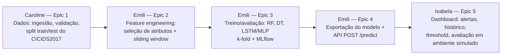

# Alinhamento dos Planos Individuais — Caroline, Emili e Isabela

**Data:** 2026-07-25
**Objetivo deste documento:** conciliar os 3 Planos Individuais de Trabalho de IC (`docs/caroline`, `docs/emili`, `docs/isabela`) com o objetivo único do projeto orientador e com os artefatos de planejamento já formalizados no BMAD (`_bmad-output/compartilhado/planning-artifacts/prd.md` e `epics.md`), eliminando sobreposições e lacunas de escopo.

> Fora de escopo aqui: a "Cartilha de Segurança na Nuvem AWS" (Meses 10-12 do `ProjetoOrientador.docx`) pertence à 4ª integrante do projeto guarda-chuva (Luisa de Paula Peixoto, PIBIT) e não faz parte do sistema de ML/dashboard tratado neste repositório.

## 1. Objetivo único do sistema (âncora de alinhamento)

> Desenvolver e validar um **sistema de previsão de ataques cibernéticos para redes acadêmicas**, que: (1) ingere e prepara dados de tráfego de rede (CICIDS2017); (2) treina e compara algoritmos de ML (Random Forest, Decision Tree, LSTM/MLP) com validação cruzada; (3) exporta o modelo vencedor como serviço de predição (`POST /predict`); e (4) exibe os alertas gerados em um dashboard de monitoramento em tempo (quase) real, com avaliação de desempenho e eficácia em ambiente simulado.

Esse é o mesmo objetivo geral presente nos 3 planos individuais e no `ProjetoOrientador.docx` — a divergência não está no objetivo, mas em **como cada relatório parcial interpretou seu escopo específico**. O mapeamento abaixo resolve isso amarrando cada plano a Epics/Stories concretas já existentes no BMAD.

## 2. Mapeamento pessoa → Epic/Story (cadeia de dependência)

| Pessoa | Plano individual (objetivo original) | Epic(s) BMAD equivalente(s) | Status real no código/sprint |
|---|---|---|---|
| **Caroline** | Coleta e pré-processamento de dados | **Epic 1** (Fundação) | ✅ `done` (1.1–1.5) |
| **Emili** | Implementação e avaliação de algoritmos de ML | **Epic 2** (Feature Engineering) + **Epic 3** (Treino/Avaliação/MLflow) + **Epic 4** (Exportação/API) | ❌ `backlog` — nenhuma story criada, nenhum código em `ml-pipeline/src/models/` |
| **Isabela** | Avaliação de desempenho/eficácia em ambiente simulado | **Epic 5** (Dashboard de Monitoramento) | ❌ `backlog` — apenas scaffolding padrão (`button.tsx`) |

## 3. Conflitos identificados e resolução proposta

### 3.1 Caroline — escopo de dataset
- **Relatório parcial diz:** pipeline cobrindo **CICIDS2017 + UNSW-NB15**, com saídas para classificação **binária e multiclasse**.
- **Contrato de dados formalizado (PRD FR1, Story 1.3/1.4):** apenas **CICIDS2017, classificação binária**.
- **Resolução:** manter UNSW-NB15 como **anexo exploratório/comparativo** documentado à parte (ex.: `docs/compartilhado/pesquisas-ml/`), sem alterar o contrato de dados oficial do pipeline, a menos que o orientador aprove expandir o FR1. O pipeline principal (`ml-pipeline/src/data/`) continua servindo só CICIDS2017 binário — é o que Epic 2/3/4/5 dependem.

### 3.2 Emili — trabalho relatado sem código correspondente
- **Relatório parcial diz:** RF, DT e LSTM/MLP já implementados, treinados e avaliados com k-fold (isso é o Epic 3 inteiro).
- **Código real:** `ml-pipeline/src/models/` só tem `__init__.py`; Epic 2 (pré-requisito) e Epic 3 estão em `backlog` no sprint.
- **Resolução:** este é o ponto crítico do alinhamento. Duas hipóteses, ação diferente para cada uma:
  1. Se o trabalho foi feito **fora do monorepo** (notebook avulso, script local) → trazer esse código para `ml-pipeline/`, criar as stories 2.1–2.3 e 3.1–3.6 retroativamente e marcá-las `done` com evidência (testes, métricas).
  2. Se o trabalho **não foi de fato concluído** (relatório descreve o planejado, não o realizado) → **isso precisa ser corrigido no relatório antes de submissão formal**, e o esforço real deve começar agora pelas stories 2.1 → 2.3 → 3.1 → 3.6, que são o gargalo de todo o restante do pipeline (Isabela e Epic 4 dependem disso).

### 3.3 Isabela — desvio de arquitetura
- **Relatório parcial diz:** protótipo próprio de aplicação web + banco de dados relacional para eventos, mais pesquisa em ataques adversariais (FGSM).
- **Arquitetura/PRD combinados (Epic 5):** dashboard React consumindo a API compartilhada (`POST /predict`) via *polling*, sem banco de dados próprio.
- **Resolução:**
  - A pesquisa em **robustez adversarial (FGSM)** é uma contribuição científica válida e pode continuar como uma **frente de avaliação complementar** (ex.: Story pós-MVP ou seção extra no artigo), mas não substitui a entrega funcional do Epic 5.
  - A **entrega de sistema** de Isabela deve convergir para o `dashboard/` já scaffolded neste repositório, consumindo a API real (ou o **endpoint mock** da Story 4.4, pensado exatamente para permitir que ela avance em paralelo enquanto Emili não termina Epic 2–4).
  - Abandonar o banco de dados relacional próprio — o histórico de alertas já é responsabilidade do backend (Story 4.3/5.4), não do frontend.

## 4. Cronograma consolidado (referência: mês 1 = Set/2025)

Hoje (2026-07-25) corresponde a aproximadamente o **mês 11 de 12** do cronograma original. Consolidando os 3 cronogramas individuais com o status real do sprint:

| Mês (orig.) | Caroline | Emili | Isabela | Status real hoje |
|---|---|---|---|---|
| 1–6 | Coleta, limpeza, split (Epic 1) | Revisão bibliográfica + seleção de algoritmos | — (não iniciada) | Epic 1 **done**; resto **backlog** |
| 7–8 | Suporte/manutenção do contrato de dados | Treino + validação cruzada (Epic 3) | Início: interfaces de alerta (Epic 5, com Emili) | ⚠️ Não iniciado — **gargalo atual** |
| 9–10 | — | Avaliação comparativa + integração ao sistema (Epic 4) | Ambiente de teste simulado, cenários de ataque | ⚠️ Bloqueado por Epic 2/3 |
| 11–12 | — | Testes finais, documentação, relatório final | Simulação, coleta/análise de resultados, relatório final | ⚠️ Bloqueado |

**Implicação prática:** o projeto está **~4–5 meses atrasado** em relação ao cronograma original se considerarmos apenas o que está de fato implementado e rastreado. A prioridade imediata e única no caminho crítico é **Emili iniciar Epic 2 (Story 2.1 — feature selection)** — sem isso, nem Epic 3, nem Epic 4, nem a integração final de Isabela podem avançar.

## 5. Ações recomendadas (próximos passos)

1. **Emili:** criar e executar as stories 2.1 → 2.2 → 2.3 (Epic 2) imediatamente; é o bloqueador de todo o resto.
2. **Isabela:** pode adiantar o scaffolding do dashboard (Story 5.1) e a integração via **endpoint mock** (Story 4.4) *em paralelo*, sem esperar Emili terminar — isso recupera parte do atraso.
3. **Caroline:** papel muda de "produção" para "suporte" — validar que o contrato de dados (Story 1.4) atende ao que Epic 2 precisa; documentar UNSW-NB15 como anexo exploratório, não como parte do pipeline principal.
4. **Todas:** revisar os relatórios parciais para garantir que as atividades declaradas como "concluídas" tenham evidência rastreável (story `done` + código no repositório), evitando a divergência identificada na seção 3.

---
*Documento gerado a partir da leitura de `docs/{caroline,emili,isabela}/Plano individual*.docx`, `docs/{caroline,emili,isabela}/Relatorio*Parcial*.docx`, `docs/compartilhado/ProjetoOrientador.docx` e `_bmad-output/compartilhado/{planning-artifacts/epics.md, implementation-artifacts/sprint-status.yaml}`.*
